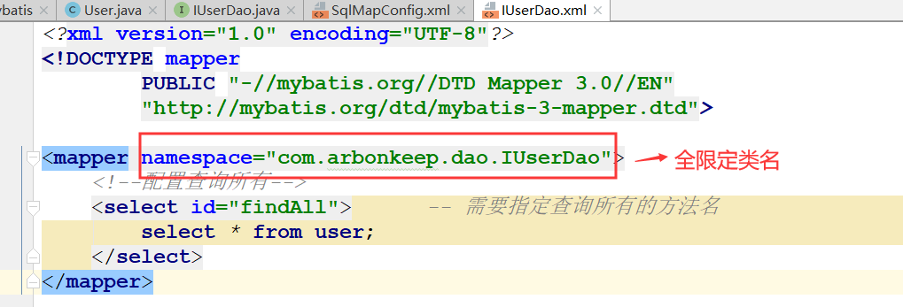

# Mybatis

## SSM框架与三层架构之间的关系
    1. 框架的概念
        * 它是我们软件开发中的一套解决方案，不同的框架解决的是不同的问题。
	
    2. 使用框架的好处：
		* 框架封装了实现细节，使开发者可以使用极简的方式实现功能。大大提高开发效率。

    3. 三层架构
        表现层：是用于展示数据的

        业务层：是处理业务需求

        持久层：是和数据库交互的

    4. SSM框架与三层架构之间的关系如下所示

## Mybatis概述
    1. mybatis是一个持久层框架，用java编写的。它封装了jdbc操作的很多细节，使开发者只需要关注sql语句本身，而无需关注
       注册驱动，创建连接等繁杂过程。它使用了ORM思想实现了结果集的封装。

    2. ORM的简介
        * ORM(Object Relational Mapping): 对象关系映射。简单的说：就是把数据库表和实体类及实体类的属性对应起来。让
                                          我们可以操作实体类就实现操作数据库表。

## Mybatis入门
    1. Mybatis的准备工作(环境搭建)
        <1> 创建相关maven工程,并导入相关的依赖
            1) mysql
                * 代码如下：
                    <dependency>
                        <groupId>mysql</groupId>
                        <artifactId>mysql-connector-java</artifactId>
                        <version>5.1.6</version>
                    </dependency>

            2) log4j
                * 代码如下：
                    <dependency>
                        <groupId>log4j</groupId>
                        <artifactId>log4j</artifactId>
                        <version>1.2.12</version>
                    </dependency>

            3) mybatis
                * 代码如下：
                    <dependency>
                        <groupId>org.mybatis</groupId>
                        <artifactId>mybatis</artifactId>
                        <version>3.4.5</version>
                    </dependency>

            4) junit
                * 代码如下：
                    <dependency>
                        <groupId>junit</groupId>
                        <artifactId>junit</artifactId>
                        <version>4.10</version>
                    </dependency>

        <2> 创建数据库的相关数据(请参考mybatis.sql)

        <3> 创建实体类和dao接口

        <4> 创建Mybatis的主配置文件:SqlMapConifg.xml
            * xml文件需要引用相关约束

        <5> 创建映射配置文件:IUserDao.xml
            * xml文件需要引用相关约束

    2. 环境搭建的注意事项
        <1> mybatis的映射配置文件位置必须和dao接口的包结构相同(参考IUserDao.java与IUserDao.xml的文件目录)

        <2> 映射配置文件的mapper标签namespace属性的取值必须是dao接口的全限定类名

        <3> 映射配置文件的操作配置（select），id属性的取值必须是dao接口的方法名

        <4> 创建IUserDao.xml 和 IUserDao.java时名称是为了保持一致。在Mybatis中它把持久层的操作接口名称和映
            射文件也叫做：Mapper。所以：IUserDao 和 IUserMapper是一样的

        <5> 当我们遵从了第一、二、三点之后，我们在开发中就无须再写dao的实现类。

    3. 入门案例(参考Test)
        <1> 案例：
            第一步：读取配置文件
            第二步：创建SqlSessionFactory工厂
            第三步：创建SqlSession
            第四步：创建Dao接口的代理对象
            第五步：执行dao中的方法
            第六步：释放资源

        <2> 使用xml配置文件的方式实现(参考mybatis)
            1) 注意事项：
                * 不要忘记在映射配置中告知mybatis要封装到哪个实体类中。配置的方式：指定实体类的全限定类名。            
                  即在接收返回结果是需要IUserDao.xml中的查询语句中指定resultType。用于指定接收查询结果的类。

        <3> 使用注解的方式实现(参考mybatis_annotation)
            1) 注意事项：
                [1] 把IUserDao.xml移除，直接在接口中使用注解@Select并且指定SQL语句

                [2] 在mybatis的主配置文件中指定映射配置文件时，需要使用class属性指定被注解的dao的全限定类名

        <3> 使用实现类的方式实现(参考mybatis_dao)

    4. 入门案例分析

    5. 自定义Mybatis(参考Mybatis_design)
        <1> Mybatis自定义实现过程的分析

## Mybatis的CRUD操作
    1. Mybatis的添加数据操作(保存)
        <1> 实现请参考mybatisCRUD

        <2> 在保存中，由于id是自增长的，所以id在用户看来是不清楚的。那么如何得到id呢
            * 使用语句
                select last_insert_id();    查看插入数据之后的id
            
            * Mybaytis中配置该语句

            * 使用该语句
        

        <3> 注意：
            1) 在Mybatis中的映射配置文件中，需要使用insert标签，详细如下：

            2) 在执行操作后需要提交事务

    2. Mybatis的更新数据与删除数据
        <1> 实现请参考mybatisCRUD
        
        <2> 注意：
            1) 在Mybatis中的映射配置文件中，更新数据需要使用update标签，删除数据使用delete标签。

    3. Mybatis的查询和模糊查询
        <1> 实现请参考mybatisCRUD

        <2> 注意：
            1) 在Mybatis中的映射配置文件中，查询需要使用select标签

            2) 这两个操作都需要指定参数的类型(parameterType)，与返回值类型(resultType)

            3) 模糊查询时，我们在映射配置文件中没有指明模糊条件，需要在使用时指定

            4) 模糊查询的另外一种写法：(这种方式在使用时就不需要加上%)
                select * from user where username like '%${value}$%'; 

    4. OGNL表达式：
	    * Object Graphic Navigation Language：对象图导航语言，它是通过对象的取值方法来获取数据。在写法上把get给省
                                              略了。
	    
            * 比如：我们获取用户的名称
		            类中的写法：user.getUsername();
		            OGNL表达式写法：user.username
	
                    * mybatis中为什么能直接写username,而不用user.呢？
		              因为在parameterType中已经提供了属性所属的类，所以此时不需要写对象名

    5. 将实体类包装起来查询用户信息
        <1> 查看QueryVo(实体类，里面封装了User信息)，在配置时，我们需要使用user.username获取，详细如下：

    6. 报错问题的解析
        <1> 当我们对实体类中的属性名称进行如下修改后（并修改了对应的set，get方法）
            username -> userName
            id -> userId
            birthday ->userBirthday
            sex -> userSex
            address -> userAddress

            发现会出现三个问题：

                1) 首先在保存数据的配置插入数据后，获取插入数据的id中keyProperty(封装类中id名称)对应的属性值发生改
                   变(由id -> userId)会报错。所以说需要修改成userId解决

                2) 其次在插入和更新数据时，查找对应的OGNL表达式出错。如：username变成了userName，这就不能够匹配了
                   所以在映射配置文件中，所有对应封装类的属性名都需要修改成与封装类(User)中的一致

                3) 查询方面的问题：
                    * 当我们查询所有时，发现除了username可以查询到，其余信息都不能查询到(也就是并没有封装进去)，那么
                      这是为什么呢？
                        * 这是因为在windows的mysql中是不区分大小写的，username只修改成userName，所以能封装进去，也
                          就能查询出来，但是其他的就不能了，因为其余的都不匹配，然而，如果在linux的mysql中的话，那么
                          所有的都不能封装进去，这是因为在linux的mySql中是区分大小写的

                    * 解决方案：
                        <1> 由于数据库中的字段与映射配置中sql语句中的字段不一致，那么我们可以通过对映射配置中的字段
                            起别名(别名需要与数据库中的字段一致)来解决

                        <2> 通过配置的方式解决。详细如下所示

                    

    

    

