# Mybatis

## Mybatis实现DAO层开发
    1. 自己实现DAO的实现类(不使用代理对象)
        <1> 参考mybatis_my_dao

        <2> 其中包括增删改查

    2. 自己实现DAO的的实现类中执行过程分析
        <1> 查询所有方法的执行流程
            1) 首先，通过debug，发现执行的selectList方法是在sqlSession的实现类DefaultSqlSession中

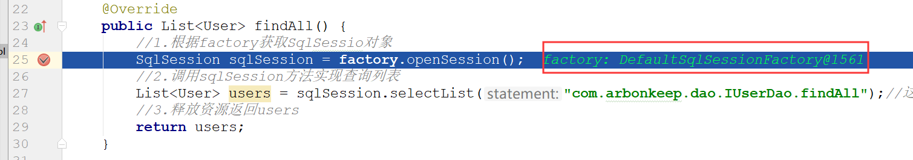

            2) 然后，我们发现，是DefaultSqlSession中的selectList方法返回的是executor.query中的内容，
            
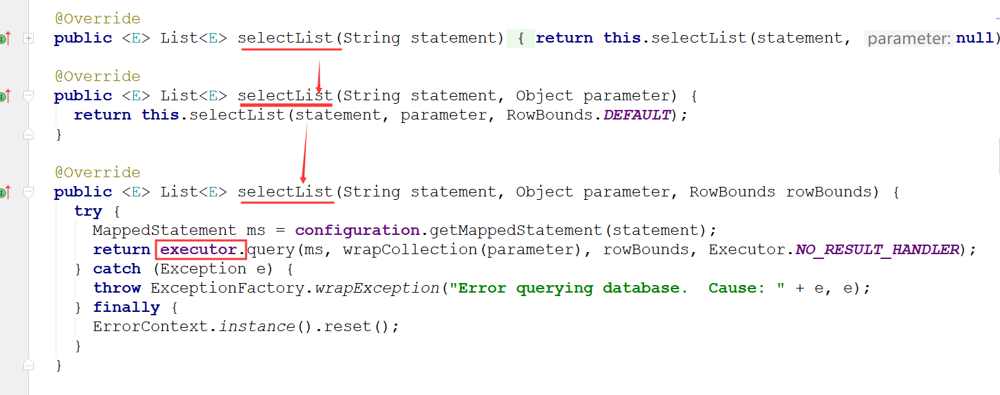

            3) 那么就需要找到executor(是一个接口)需要找到实现类(同样debug，发现实现类是CachingExecutor中的query
               方法在执行)

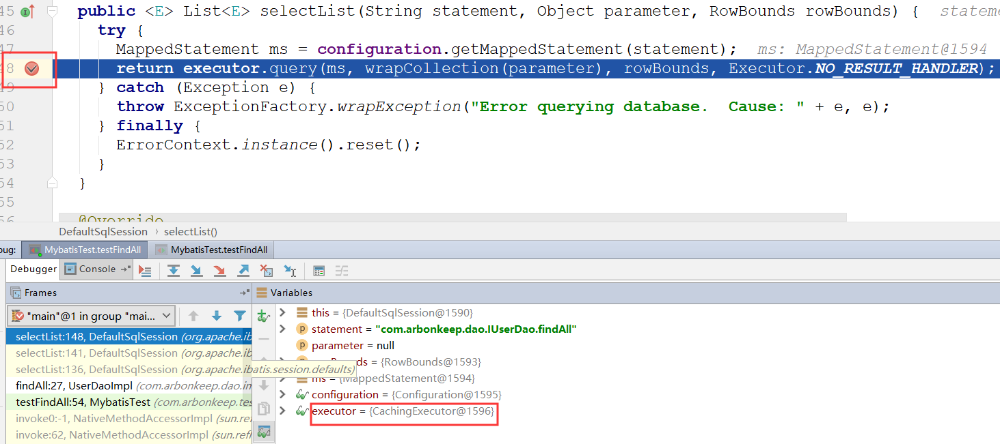

            4) 然后找到CachingExecutor中的query方法，找到对应的方法之后，我们就继续打断点，进入该方法之后，发现返
               回的还是一个query方法

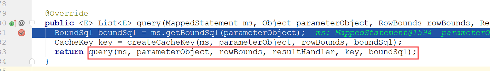
            
            5) 然后进入query，就是下面方法

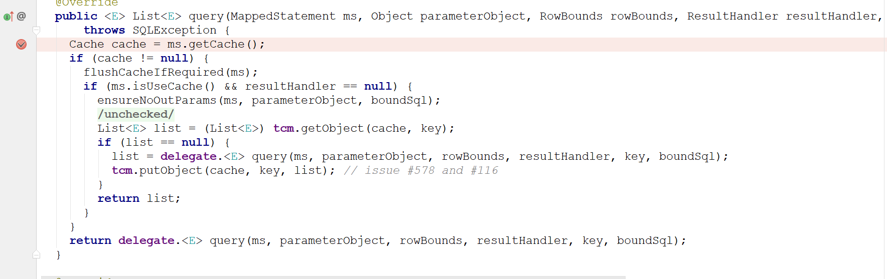

            6) 由于在该query方法中有判断，所以我们需要继续断点，确定到底代码走哪里(走最后一行)，delegate是在Simpl
               eExecutor中

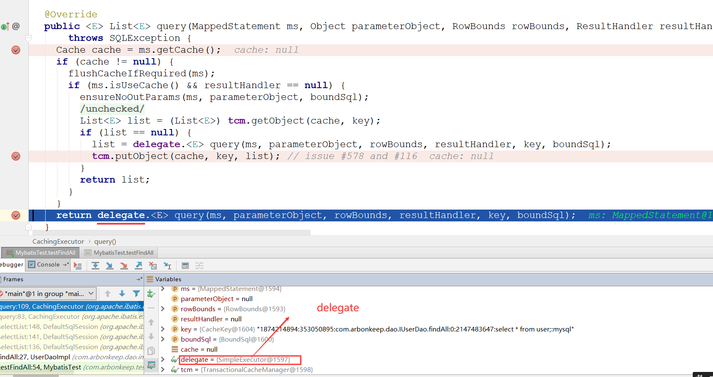

            7) 然后进入SimpleExecutor，发现只有doQuery方法，也就是最终执行的就是该方法。(那么前面的query方法在哪
               呢？这就在SimpleExecutor的父类BaseExecutor中)。也就是说首先执行了BaseExector中的query方法，然后最
               后调用了doQuery方法

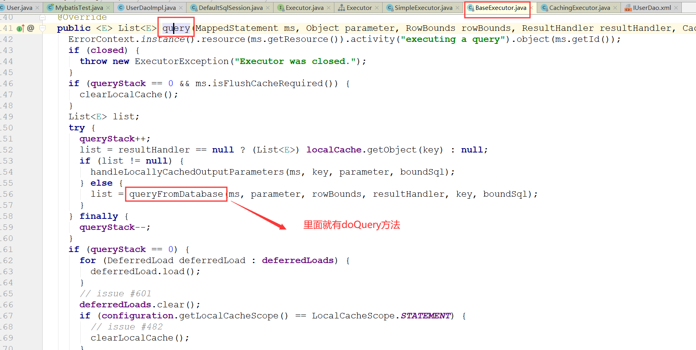

            8) 执行了BaseExecutor中的query方法和queryFromDatabase方法，在queryFromDatabase方法中调用了doQuery方
               法

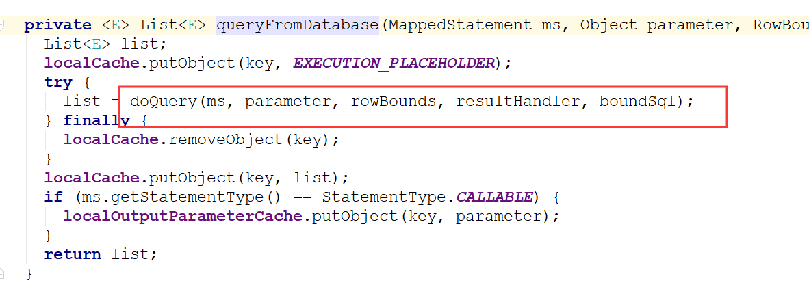

            9) 然后进入doQuery方法，在第一行打一个断点，让程序进入到该方法，发现返回一个Handler，是RountingState
               menthandler。

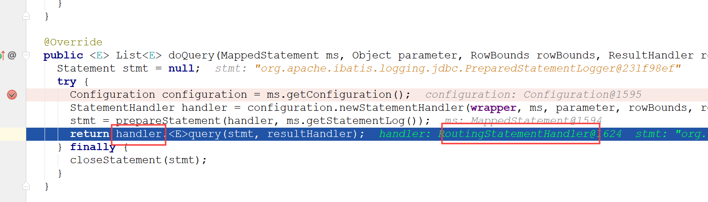

            10) 进入RountingStatementhandler，然后发现有query方法，打个断点，让程序走到这里，发现delegate是Prep
                areStatementhandler

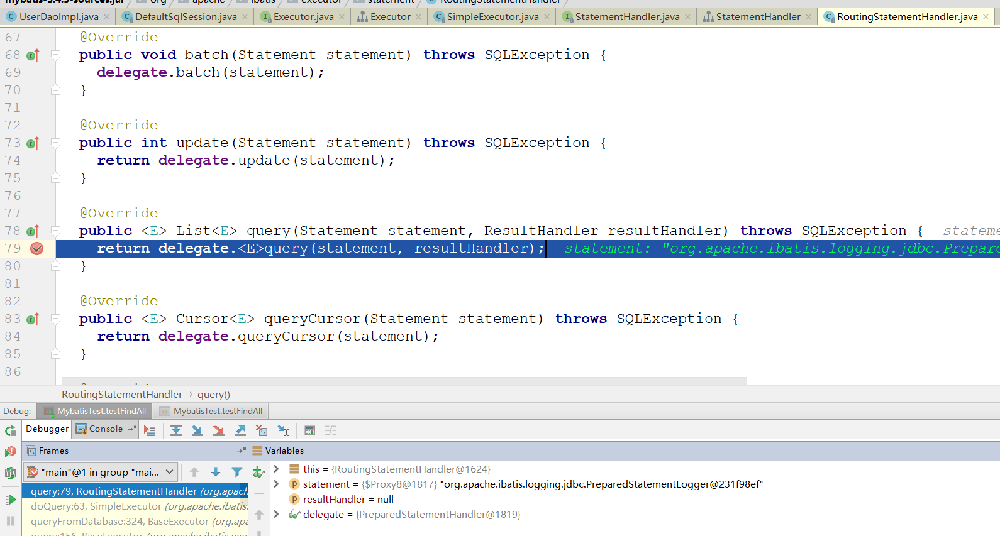

            11) 进入PrepareStatementhandler，打断点，让程序进入，发现返回的是JDBC对象(JDBC中查询结果对象，在这
                返回的是一个代理对象)，并且有执行方法execute，返回的是resultSetHandler(此处执行完成，之后就封装
                结果集)

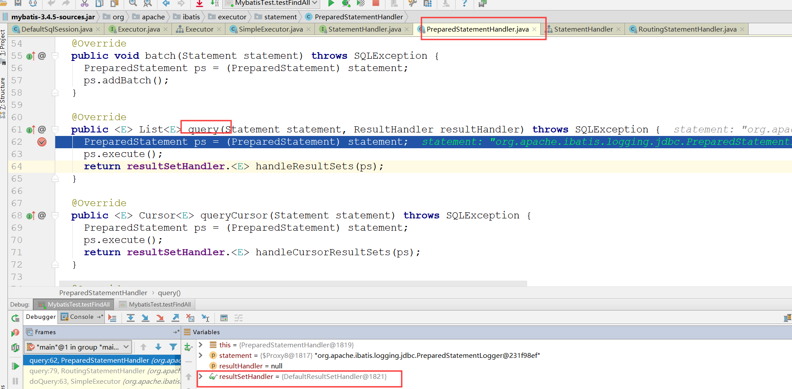   

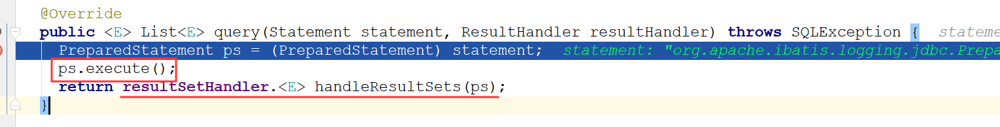

            12) 进入resultSetHandler的唯一实现类DefaultResultSetHandler，找到handleResultSets，并打断点，让程序
                进入，在这个方法中就在封装结果集

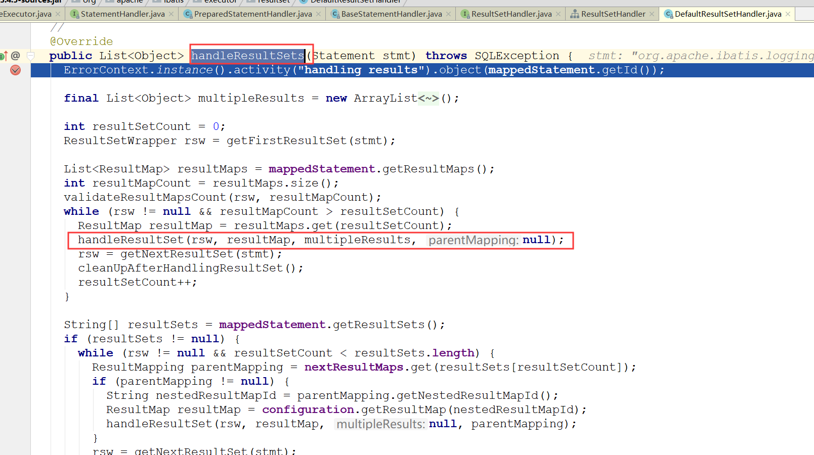

        <2> 对JDBC中PreparedStatement对象执行方法的总结
            1) execute方法：它能够执行CRUD中任意一种语句，它的返回值是一个boolean类型，表示是否有结果集，有就返回
                            true，没有就返回false

            2) executeUpdate方法：它只能执行CUD语句，不能执行查询语句，它的返回值是影响数据库记录的行数

            3) executeQuery方法：它只能执行select语句，无法执行增删改，执行结果是封装的结果集ResultSet对象

        <3> 保存方法(插入数据)的执行过程(分析方式与查询所有类似)
            1) 首先，在测试保存数据的方法中，打断点，发现SqlSession是DefaultSqlSession，由于调用了insert方法，所
               以我们在DefaultSqlSession中找到insert方法(两个参数)，发现该方法是调用该类中update方法，完成操作的

            2) 进入update方法，发现与查询所有类似，但是调用executor的是update方法

            3) 同样，我们向下执行发现，executor也是CachingExecutor，所以进入该类，找到update方法，然后进入该方法
               发现返回delegate，其中该值为SimpleExcutor

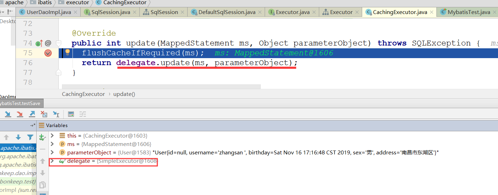

            4) 进入该类SimpleExcutor，找到update方法，同样，该类的父类BaseExecutor中才有update方法，不过最终都会
               调用SimpleExecutor中的doUpdate方法

            5) 进入doUpdate方法后，发现最后返回Handler.update(),并且发现handler为RountingStatementHandler，所以
               进入该类

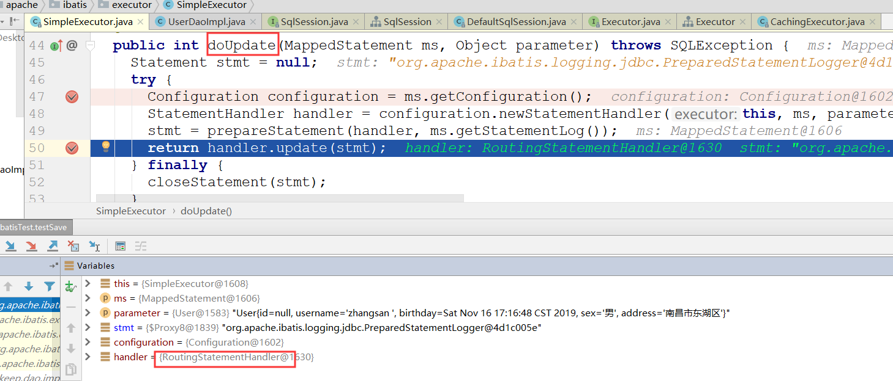

            6) 该类中，调用了delegate.update,而delegate为PrepareStatementHandeler，所以需要进入该类。

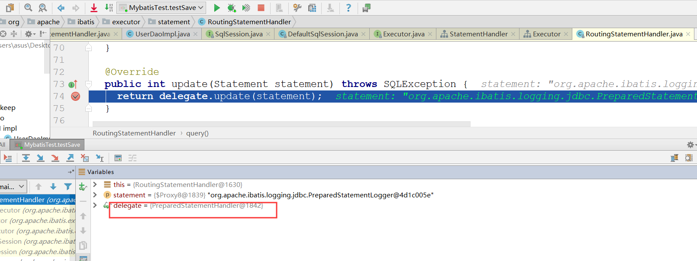

            7) 该类中有执行方法execute，也有执行insert的返回值int类型数据，所以至此就完成执行了

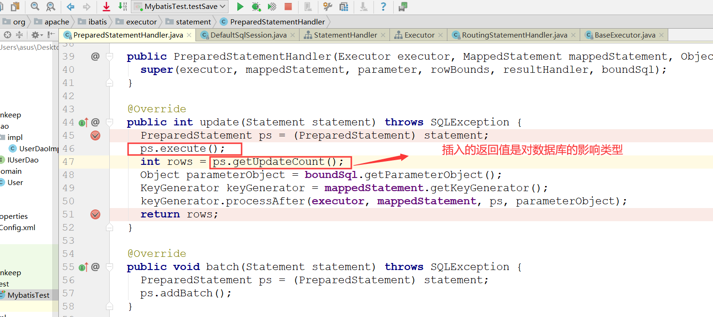

        <4> 在Mybatis中，实现dao的CUD都与上面类似，就不再详细的分析执行过程了

