# Mybatis

## 标签的配置
    1. 对工程mybatisCRUD的标签配置进行修改
        <1> 起先配置如下所示

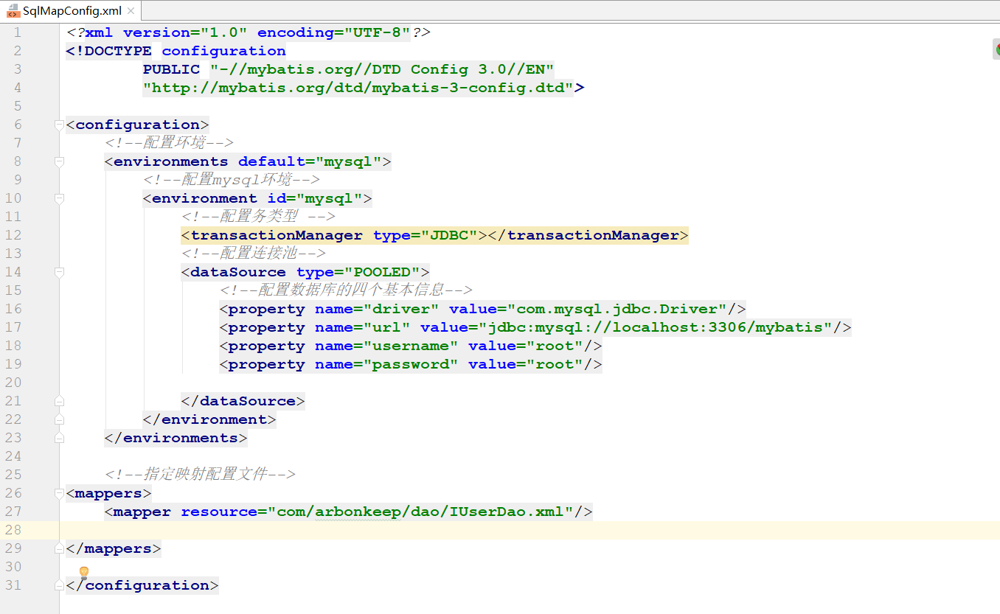

        <2> 修改1：使用properties标签将property标签提出到外面

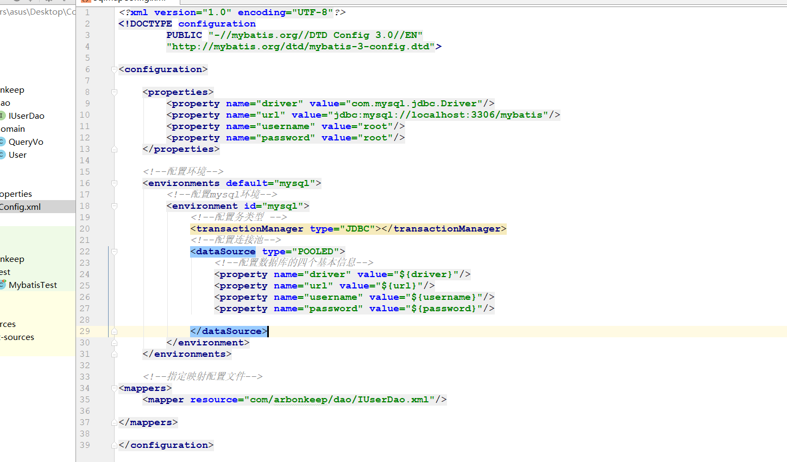

        <3> 修改2：将properties中的内容从外部文件引入(详细参考mybatisCRUD)
            * 注意：
                1) 使用resource属性（需要将配置文件放在resources目录下）

                2) 使用url属性(需要在路径前面加上file协议即：file:///)

    2. typeAliases标签的配置
        <1> 功能：使用typeAliases配置别名，它只能配置domain中的类的别名
        
        <2> 该标签下的子标签
            1) typeAlias:用于配置别名。type属性指定的是实体类的全限定类名。alias指定的是别名，当指定了别名就不再区分
                         大小写

            2) package:用于指定要配置别名的包，当指定之后，该包下的实体类都会注册别名，并且类名就是别名，不在区分大小
                       写

        <3> mappers标签中的package
            * 功能：标签是用于指定dao接口所在包，当指定了之后就不再需要写mapper以及resource或者class属性了

## Mybatis中连接池以及事务的控制

    1. 连接池：我们在实际开发中都会使用连接池。因为它可以减少我们获取连接所消耗的时间。
        <1> 概念：连接池就是用于存储连接的一个容器。就是一个集合对象，该集合必须是线程安全的，因为两个线程不能获取到同一
                 个链接。该集合还需要满足队列的性质：先进先出

    2. mybatis中的连接池
	    <1> mybatis连接池提供了3种方式的配置：
            1) 配置的位置：
                主配置文件SqlMapConfig.xml中的dataSource标签，type属性就是表示采用何种连接池方式。

            2) type属性的取值：
                * POOLED: 采用传统的javax.sql.DataSource规范中的连接池，mybatis中有针对规范的实现

                * UNPOOLED: 采用传统的获取连接的方式，虽然也实现Javax.sql.DataSource接口，但是并没有使用池的思想。

                * JNDI:采用服务器提供的JNDI技术实现，来获取DataSource对象，不同的服务器所能拿到DataSource是不一样。
                       注意：如果不是web或者maven的war工程，是不能使用的。

                * 我们课程中使用的是tomcat服务器，采用连接池就是dbcp连接池。

        <2> 采用POOLED与UNPOOLED区别
            1) POOOLED对应JAVA中PooledDataSource类，UNPOOLED对应UnpooledDataSource类

            2) 在Mybatis中采用两种方式配置的运行日志不同(采用方式不同)。如下所示

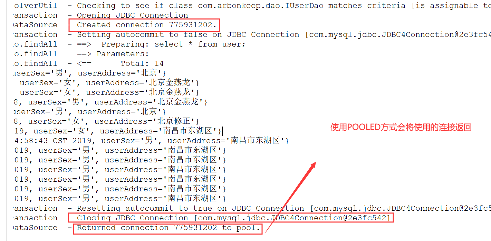

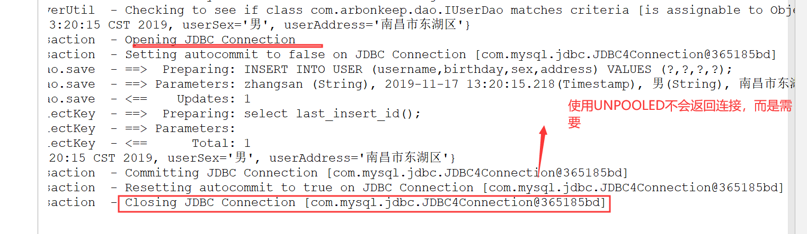

        <3> 采用UNPOOLED方式，在UnpooledDataSource类中是直接通过获取连接来获得的并没有使用连接池技术
            1) 进入该类，找到getConnection方法。往里面追源码，最终发现是通过JDBC的方式来获取连接的

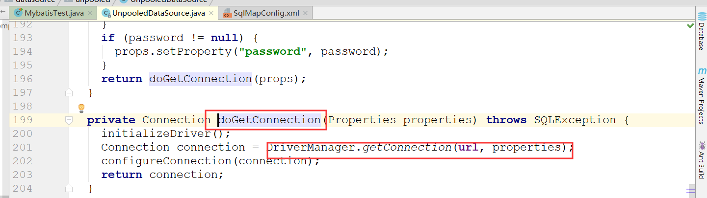

        <4> 采用POOLED方式，在PooledDataSource类中使用了连接池技术获取连接，最后需要归还链接
            1) 同样进入该类，找到getConnection方法，往里追源码，找到popConnection方法，如果池中有空闲连接，就直接
               拿出来使用

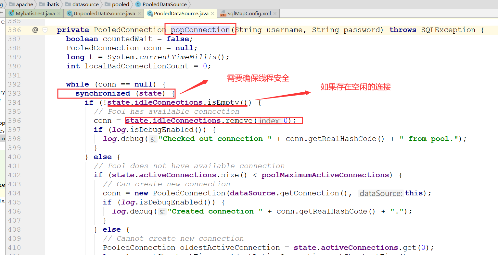

            2) 往里面发现，idleConnections是一个集合，也就是存储链接的集合

            3) 如果活动连接池小于最大连接数，就会创建一个新连接，如果没有空间了，就会释放最老的连接提供给使用者使用

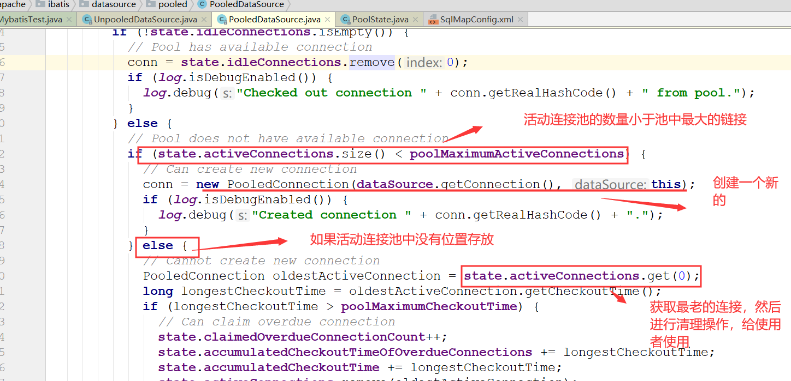

            4) POOLED的原理图

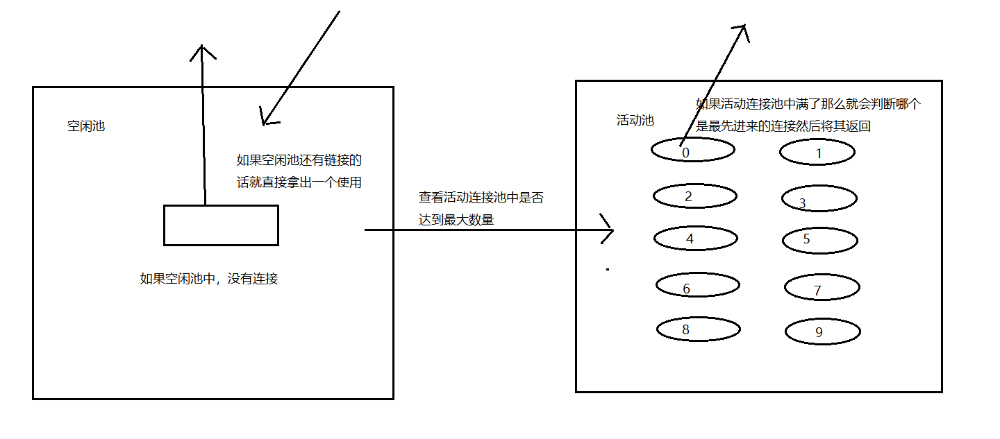

        <5> 使用JNDI方式配置
            1) JDNI: Java Naming and Directory Interface,java命名和命令接口

            2) 使用JNDI的方式配置(请参考mybatis_JNDI)

    3. 事务
        <1> Mybatis中的事务控制
            1) 它是通过sqlsession对象的commit方法和rollback方法实现事务的提交和回滚

            2) 默认是通过unAutoCommit提交的

            3) 设置自动提交的方式：使用session对象调用openSession(true)方法就能设置自动提交事务。但是一般我们不建
                                  议这样使用，因为这样就不能很好的控制多操作事务

## Mybatis映射文件的SQL深入(动态SQL)
    1. 动态SQL中if标签的使用
        * <if>标签的 test 属性中写的是对象的属性名，如果是包装类的对象要使用 OGNL 表达式的写法。

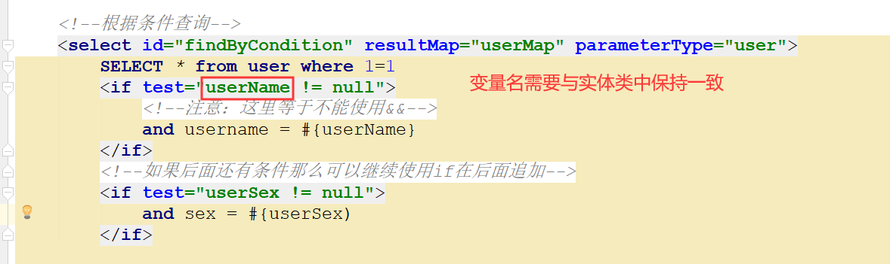

    2. where标签的使用

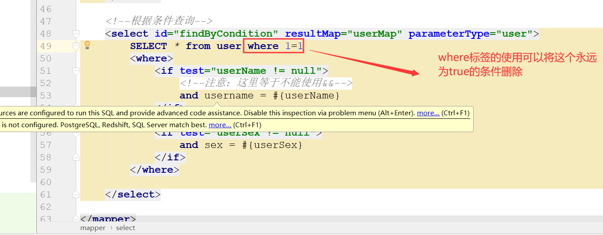

    3. foreach标签的使用
        * <foreach>标签用于遍历集合，它的属性：
            * collection:代表要遍历的集合元素，注意编写时不要写#{}

            * open:代表语句的开始部分

            * close:代表结束部分

            * item:代表遍历集合的每个元素，生成的变量名
            
            * sperator:代表分隔符

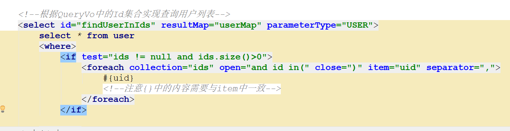

    4. 抽取重复的sql语句
        * 使用sql标签可以抽取

        * 引用需要使用include标签

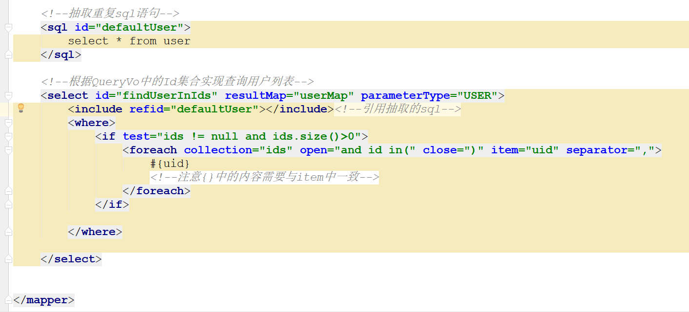

## Mybati中的多表查询
    1. Mybatis中表之间关系的分析
        <1> 表之间的关系有几种：
            * 一对多
                * 用户和订单就是一对多

            * 多对一
                * 多个订单属于同一个用户

            * 一对一
                * 人和身份证号就是一对一,一个人只能有一个身份证号,一个身份证号只能属于一个人

            * 多对多
                * 老师和学生之间就是多对多,一个学生可以被多个老师教,一个老师可以教多个学生		
	
        <2> 特例：
            * 如果拿出每一个订单，他都只能属于一个用户。所以Mybatis就把多对一看成了一对一。

    2. mybatis中的多表查询之一对一和一对多：
		<1> 示例：用户和账户
			* 一个用户可以有多个账户
			* 一个账户只能属于一个用户（多个账户也可以属于同一个用户）

		<2> 步骤：
			1) 建立两张表：用户表，账户表
				让用户表和账户表之间具备一对多的关系：需要使用外键在账户表中添加

			2) 建立两个实体类：用户实体类和账户实体类
				让用户和账户的实体类能体现出来一对多的关系

			3) 建立两个配置文件
				用户的配置文件
				账户的配置文件
                
			4) 实现配置：
				当我们查询用户时，可以同时得到用户下所包含的账户信息
				当我们查询账户时，可以同时得到账户的所属用户信息
        
        <3> 实现请参考mybatis_one2many(用于演示一对一和一对多)

    3. mybatis中的多表查询之多对多
        <1> 示例：用户和角色
			* 一个用户可以有多个角色
			* 一个角色可以赋予多个用户
		<2> 步骤：
			1) 建立两张表：用户表，角色表
			    让用户表和角色表具有多对多的关系。需要使用中间表，中间表中包含各自的主键，在中间表中是外键。

			2) 建立两个实体类：用户实体类和角色实体类
				让用户和角色的实体类能体现出来多对多的关系
				各自包含对方一个集合引用

			3) 建立两个配置文件
				用户的配置文件
				角色的配置文件
                
			4) 实现配置：
				当我们查询用户时，可以同时得到用户所包含的角色信息
				当我们查询角色时，可以同时得到角色的所赋予的用户信息
        
        <3> 实现请参考mybatis_many2many(演示多对多的关系)

    

        

        

