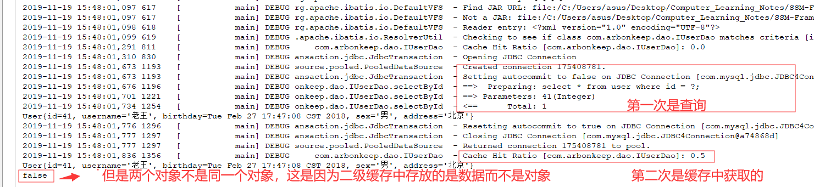

# Mybatis

## Mybatis中的延迟加载
    1. 问题：在一对多中，当我们有一个用户，它有100个账户。
	      * 在查询用户的时候，要不要把关联的账户查出来？
	      * 在查询账户的时候，要不要把关联的用户查出来？
		
	      在查询用户时，用户下的账户信息应该是，什么时候使用，什么时候查询的。
	      在查询账户时，账户的所属用户信息应该是随着账户查询时一起查询出来。

        <1> 什么是延迟加载
            在真正使用数据时才发起查询，不用的时候不查询。按需加载（懒加载）

        <2> 什么是立即加载
            不管用不用，只要一调用方法，马上发起查询。
	
	    <3> 在对应的四种表关系中：一对多，多对一，一对一，多对多
            一对多，多对多：通常情况下我们都是采用延迟加载。
            多对一，一对一：通常情况下我们都是采用立即加载。

    2. 使用association标签如何实现延迟加载(一对一的方式)（参考mybatis_lazy）
        <1> 首先需要配置如下

        <2> 完成下面配置之后，我们就得到了下面结果，不过这并不是延迟加载的，而是一次性全部加载出来的
            这是因为我们没有将相关控制延迟加载的配置打开

 

        <3> 接下来需要在mybatis朱配置文件中配置两个属性才能使用
            1) 延迟加载的全局开关(lazyloadingEnabled):当开启时，所有关联对象都会延迟加载，默认值为fasle

            2) (aggressiveLazingLoading):当开启时，任何方法的调用都会加载该对象的所有属性，否则每个属性会按需加载
                                         在mybatis3.4.1之后默认为false

        <4> 配置完成之后，运行测试类得到的结果就是延迟加载的

        <5> 所以，我们不遍历查询的结果，那么就不会加载出对应的内容

    3. 使用colection标签如何实现延迟加载(一对多的方式：通过用户的id查询账户信息)
        <1> 同样需要在collection标签中进行配置

        <2> 之后步骤与在association中一样(在主配置文件中，配置了就不需要在配置)

        <3> 查询得到的结果如下所示

## Mybatis中的缓存
    1. 缓存概述
        <1> 什么是缓存
		    * 存在于内存中的临时数据。

        <2> 为什么使用缓存
            * 减少和数据库的交互次数，提高执行效率。

        <3> 什么样的数据能使用缓存，什么样的数据不能使用
            * 适用于缓存：
                经常查询并且不经常改变的。
                数据的正确与否对最终结果影响不大的。

            * 不适用于缓存：
                经常改变的数据
                数据的正确与否对最终结果影响很大的。
                例如：商品的库存，银行的汇率，股市的牌价。

        <4> Mybatis中的一级缓存和二级缓存
            1) 一级缓存：
                它指的是Mybatis中SqlSession对象的缓存。当我们执行查询之后，查询的结果会同时存入到SqlSession为我们
                提供一块区域中。该区域的结构是一个Map。当我们再次查询同样的数据，mybatis会先去sqlsession中查询是否
                有，有的话直接拿出来用。当SqlSession对象消失时，mybatis的一级缓存也就消失了。
            
            2) 二级缓存:
                * 它指的是Mybatis中SqlSessionFactory对象的缓存。由同一个SqlSessionFactory对象创建的SqlSession共
                  享其缓存。

                * 二级缓存的使用步骤：
                    第一步：让Mybatis框架支持二级缓存（在SqlMapConfig.xml中配置）
                    第二步：让当前的映射文件支持二级缓存（在IUserDao.xml中配置）
                    第三步：让当前的操作支持二级缓存（在select标签中配置）

    2. 演示一级缓存（参考mybatis_cacahe）
        <1> 如下所示，第二个user对象是从缓存中获取的

        <2> 如下所示，当我们将sqlSession关闭，重新获取或者清除sqlSession之后，两个user对象不再是相同的对象，也就是
            说第二个user对象并不是从缓存中取的

    3. 演示一级缓存更新操作（参考mybatis_cacahe）
        <1> 一级缓存是sqlSession范围的缓存，当调用sqlSession的修改，添加，删除，commit,close,clearcache方法时，会
            清空一级缓存

        <2> 如下所示

    4. 演示二级缓存（参考mybatis_cacahe）
        <1> 如图所示，Mybatis的二级缓存是这样实现的

        <2> 配置三个内容，使用二级缓存
            1) 第一个配置。让Mybatis框架支持二级缓存（在SqlMapConfig.xml中配置）

            2) 第二第三个配置。让当前的映射文件支持二级缓存（在IUserDao.xml中配置）
                              让当前的操作支持二级缓存（在select标签中配置）

        <3> 测试类运行结果如下
            * 二级缓存中存放的是数据而不是对象。这是使用散装的数据组合起来重新创建的对象，并将其返回，这就是为什么
              为false

## Mybatis的注解开发
    1. Mybatis注解开发的环境搭建(参考mybatis_annotation2)

    2. 注意：在使用注解开发时，不能够配置xml文件，即使没有使用也不可以。就是说两者不能够同时存在

