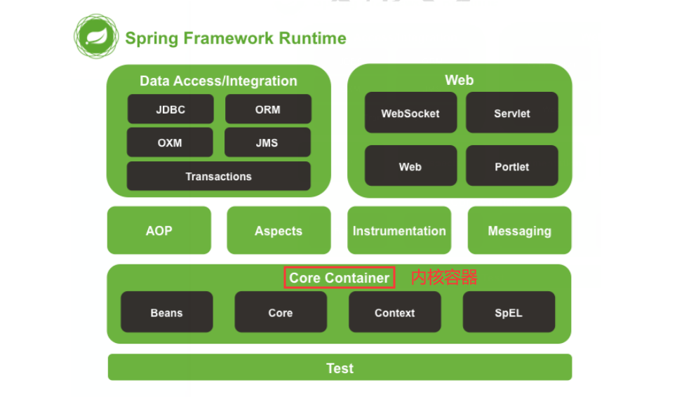
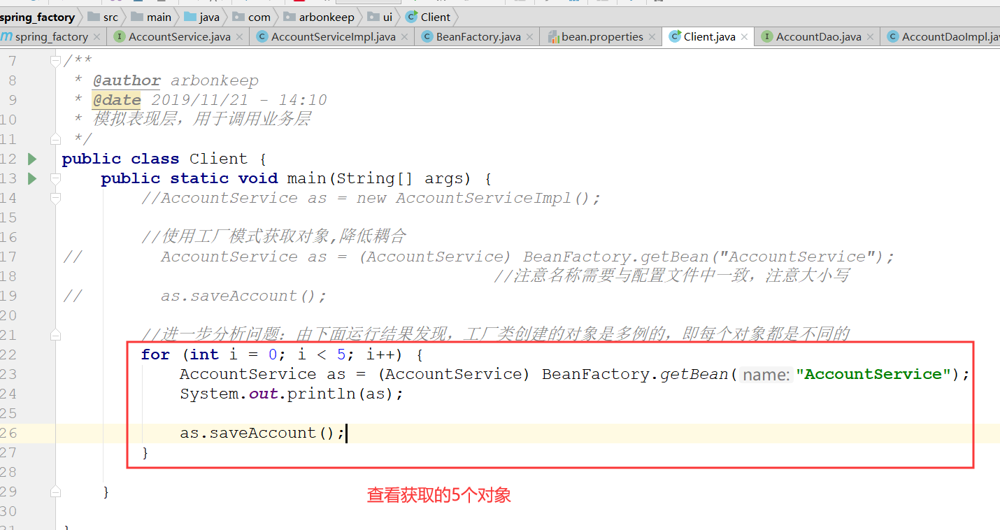
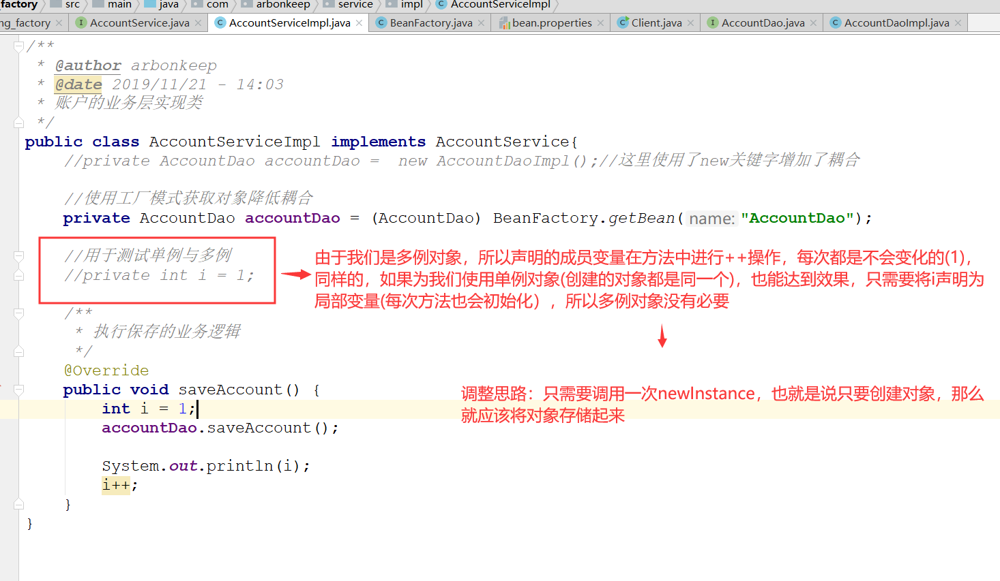
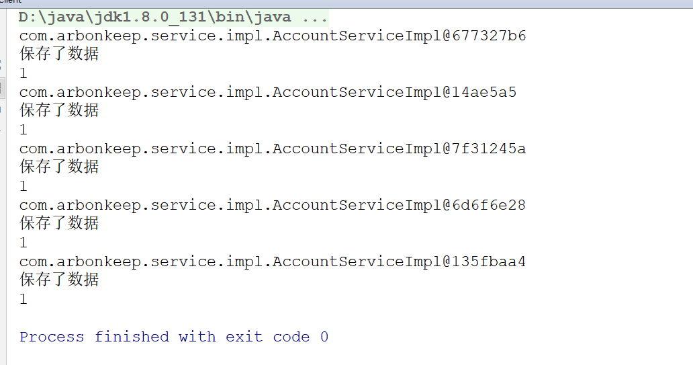
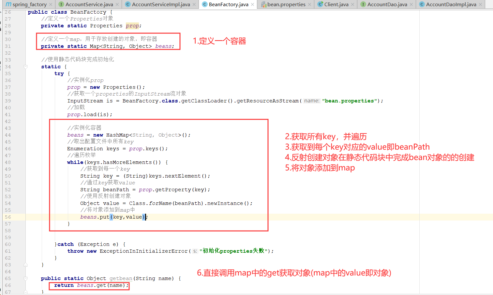
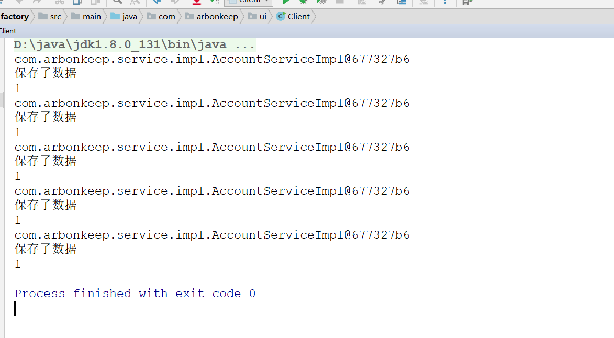

# Spring

## Spring 概述
    1. 什么是Spring
        *  Spring 是分层的 Java SE/EE 应用 full-stack 轻量级开源框架，以 IoC（Inverse Of Control：反转控制）
           和 AOP（Aspect Oriented Programming：面向切面编程）为内核，提供了表现层 SpringMVC 和持久层 Spring
           JDBC 以及业务层事务管理等众多的企业级应用技术，还能整合开源世界众多著名的第三方框架和类库，逐渐成为使
           用最多的 Java EE 企业应用开源框架。

    2. Spring的优势
        <1> 方便解耦，简化开发

        <2> AOP 编程的支持

        <3> 声明式事务的支持

        <4> 方便程序的测试

        <5> 方便集成各种优秀框架

        <6> 降低 JavaEE API 的使用难度

    3. Spring 的体系结构
        

## IOC的概念和作用
    1. 程序的耦合与解耦
        <1> 程序的耦合：在软件工程中，简单理解就是程序间的依赖关系。它包括：类之间的依赖与方法间的依赖
       
        <2> 解耦：降低程序间的依赖
        
        <3> 实际开发中应该做到：编译期不依赖，运行时才依赖
        
        <4> 举例：JDBC中的耦合(详细代码参考spring_jdbc)
            * 解耦的思路：
                1) 使用反射来创建对象，而避免使用new关键字
                2) 通过读取配置文件的方式来获取要创建对象的全限定类名(这样可以解决如果使用oracle数据库不能注册的
                   问题)

    2. 举例：使用mvc三层架构开发时，耦合性较高(参考代码spring_factory)
        <1> 问题：在表现层和业务层都使用了new关键字，它们之间的耦合性较高

        <2> 同样，如果去除了所依赖的类，那么就会报出一个编译期的错误。
        
        <3> 那么该如何解决这个问题耦合性问题呢？
            * 使用工厂模式进行解耦

        <4> 实现步骤（配置文件可以是xml或者properties文件）
            1) 需要一个配置文件对我们的service和dao进行配置
                    其中配置内容包括：唯一标识=全限定类名(key = value)

            2) 通过读取配置文件，使用反射创建对象

            3) 详细请参考spring_factory.factory.BeanFactory实现

        <5> 完成解耦之后依然存在问题(创建的对象是多例的)

        <6> 接下来我们做这样一个实验
            1) 在Client客户端和AccountServiceImpl进行如下修改

            2) 运行结果如下所示,说明对象都是多例的，也就是说5个对象不同，这是因为我们每获取对象都是通过newInstance
               每个对象不同，所以i++一直都是1，单例对象也能达到效果

            3) 按照前面提到的思路（将创建到的对象存储起来），完成改造

            4) 按照之前的实验，如果使用成员变量的话就就会得到如下结果

            5) 如果声明为局部变量，结果就如下

            6) 对于这个实验中，空指针异常的见解。(这是由于在编写代码时，静态代码块进行初始化时，再次调用了该类中
               的方法，导致while循环第一次读取到数据还没有完全结束，就调用方法去获取第二次循环的数据，出现不能获
               取到第二个数据的情况。这是我们可以通过间歇性判断解决，在调用方法时，如果获取的数据为null，那么就
               重新获取)
            

    3. IOC介绍
        * 控制反转（Inversion of Control，缩写为IoC），是面向对象编程中的一种设计原则，可以用来减低计算机代码之间
          的耦合度。其中最常见的方式叫做依赖注入（Dependency Injection，简称DI），还有一种方式叫“依赖查找”
          （Dependency Lookup）

    4. 

