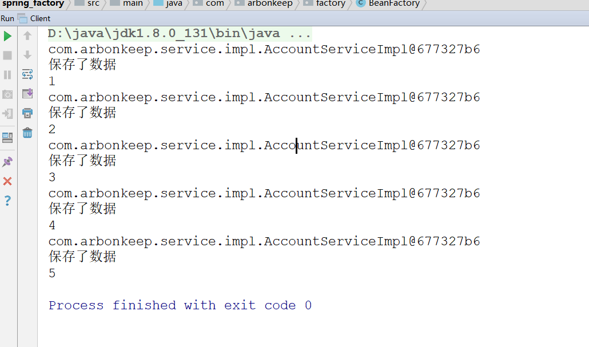

# Spring

## Spring 概述
    1. 什么是Spring
        *  Spring 是分层的 Java SE/EE 应用 full-stack 轻量级开源框架，以 IoC（Inverse Of Control：反转控制）
           和 AOP（Aspect Oriented Programming：面向切面编程）为内核，提供了表现层 SpringMVC 和持久层 Spring
           JDBC 以及业务层事务管理等众多的企业级应用技术，还能整合开源世界众多著名的第三方框架和类库，逐渐成为使
           用最多的 Java EE 企业应用开源框架。

    2. Spring的优势
        <1> 方便解耦，简化开发

        <2> AOP 编程的支持

        <3> 声明式事务的支持

        <4> 方便程序的测试

        <5> 方便集成各种优秀框架

        <6> 降低 JavaEE API 的使用难度

    3. Spring 的体系结构
        

## IOC的概念和作用
    1. 程序的耦合与解耦
        <1> 程序的耦合：在软件工程中，简单理解就是程序间的依赖关系。它包括：类之间的依赖与方法间的依赖
       
        <2> 解耦：降低程序间的依赖
        
        <3> 实际开发中应该做到：编译期不依赖，运行时才依赖
        
        <4> 举例：JDBC中的耦合(详细代码参考spring_jdbc)
            * 解耦的思路：
                1) 使用反射来创建对象，而避免使用new关键字
                2) 通过读取配置文件的方式来获取要创建对象的全限定类名(这样可以解决如果使用oracle数据库不能注册的
                   问题)

    2. 举例：使用mvc三层架构开发时，耦合性较高(参考代码spring_factory)
        <1> 问题：在表现层和业务层都使用了new关键字，它们之间的耦合性较高

        <2> 同样，如果去除了所依赖的类，那么就会报出一个编译期的错误。
        
        <3> 那么该如何解决这个问题耦合性问题呢？
            * 使用工厂模式进行解耦

        <4> 实现步骤（配置文件可以是xml或者properties文件）
            1) 需要一个配置文件对我们的service和dao进行配置
                    其中配置内容包括：唯一标识=全限定类名(key = value)

            2) 通过读取配置文件，使用反射创建对象

            3) 详细请参考spring_factory.factory.BeanFactory实现

        <5> 完成解耦之后依然存在问题(创建的对象是多例的)

        <6> 接下来我们做这样一个实验
            1) 在Client客户端和AccountServiceImpl进行如下修改

            2) 运行结果如下所示,说明对象都是多例的，也就是说5个对象不同，这是因为我们每获取对象都是通过newInst
               ance，每个对象不同，所以i++一直都是1，单例对象也能达到效果

            3) 按照前面提到的思路（将创建到的对象存储起来），完成改造

            4) 按照之前的实验，如果使用成员变量的话就就会得到如下结果

            5) 如果声明为局部变量，结果就如下

            6) 对于这个实验中，空指针异常的见解。(这是由于在编写代码时，静态代码块进行初始化时，再次调用了该类中
               的方法，导致while循环第一次读取到数据还没有完全结束，就调用方法去获取第二次循环的数据，出现不能获
               取到第二个数据的情况。这是我们可以通过间歇性判断解决，在调用方法时，如果获取的数据为null，那么就
               重新获取)
            

    3. IOC介绍
        * 控制反转（Inversion of Control，缩写为IoC），是面向对象编程中的一种设计原则，可以用来减低计算机代码之
          间的耦合度。其中最常见的方式叫做依赖注入（Dependency Injection，简称DI），还有一种方式叫“依赖查找”
          （Dependency Lookup）

## 使用Spring的IOC解决程序的耦合
    1. ApplicationContext接口的三个实现类
        <1> ClassPathXmlApplicationContext:它可以加载类路径下的配置文件，要求配置文件必须在类路径下，不在的话
                                           就不能加载
        
        <2> FileSystemXmlApplicationContext：它可以加载磁盘任意路径下的配置文件（必须要有访问权限）
        
        <3> AnnotationConfigApplicationContext：用于读取注解创建容器
     
    2. BeanFactory与ApplicationContext的对比
        <1> ApplicationContext:
            * 它在构建核心容器时，创建对象采取的策略是采用立即加载的方式，也就是说，只要一读取完配置文件立刻就会
              创建配置文件中的对象

            * 适用于单例对象

        <2> BeanFactory:
            * 它在构建核心容器时，创建对象采用的策略是采用延迟加载的方式，也就是说什么时候根据id获取对象，那么就
              什么时候创建对象

            * 适用于多利对象

    3. Spring中对bean的管理：创建bean的三种方式(参考spring_bean)
        <1> 第一种方式：使用默认构造函数创建
                * 在Spring的配置文件中使用bean标签，配置id和class属性之后，且没有其他属性和标签时。

                * 采用的就是默认构造函数创建bean对象，此时如果类中没有默认构造函数就会创建失败。举例如下：

            <bean id="AccountService" class="com.arbonkeep.service.impl.AccountServiceImpl"></bean>

        <2> 第二种方式：使用普通工厂中的方法创建对象(使用某个类中的方法创建对象，并存入spring容器)
                * 需要使用两个属性：
                    * factory-bean指定获取目标对象的类(能够获取对象的类的全限定类名)

                    * factory-method指定获取目标对象的方法
                
                * 举例如下：

            <bean id="instanceFactory" class="com.arbonkeep.factory.InstanceFactory"></bean>
            <bean id="AccountService" factory-bean="instanceFactory" factory-method="getAccountServi
            ce"></bean>

        <3> 第三种方式:使用工厂中的静态方法来创建对象(使用某个类中的静态方法来创建对象，并存入spring容器中)
                * 直接使用factory-method指定工厂类静态方法即可

                * 举例如下：
                
            <bean id="AccountService" class="com.arbonkeep.factory.StaticFactory" factory-method="get
            AccountService"></bean>

    4. bean的作用范围
        <1> bean标签的scope属性：
            * 作用：用于指定bean的作用范围

            * 取值：常用的是单例的和多例的
                singleton：单例的(默认值)
                prototype：多例的
                request：作用于web应用的请求范围
                session：作用于web应用的会话范围
                global-session：作用域集群环境的会话范围(全局会话范围)，当不是全局范围时，它就是session

        <2> 对于全局范围的介绍
            * 使用个全局范围可以解决访问资源时，有多个ip，登录时，访问ip不同的情况，如果设置为全局会话范围就可
              以解决这个问题

    5. bean对象的生命周期
        * 单例对象：
            诞生：当容器创建时对象就诞生了
            存活：如果容器存在，那么对象就会一直存在
            死亡：单例对象的生命周期与容器相同

        * 多例对象
            诞生：当使用对象时，spring框架为使用者创建
            存活：对象在使用的过程中一直存活
            死亡：当对象长时间不使用，没有其他对象引用时，由Java的垃圾回收器回收

## spring的依赖注入（参考spring_DI）
    1. 依赖注入的概述
        <1> 依赖注入：Dependency injection，依赖关系的维护
        
        <2> IOC的作用：降低程序间的耦合（依赖）
        
        <3> 依赖关系的管理：使用spring管理。也就是在当前类需要用到其他类的对象，spring会提供，我们需要
                      配置即可

        <4> 依赖注入的数据：三种
            * 基本类型和String
            * 其它bean类型（在配置文件中或者注解配置过的bean）
            * 复杂类型或集合类型

        <5> 依赖注入的方式：三种
            * 第一种：使用构造函数提供
            * 第二种：使用set方法提供
            * 第三种：使用注解提供

    2. 构造函数注入
        <1> 使用标签：constructor-arg
        
        <2> 标签出现位置：bean标签内部
        
        <3> 标签中的属性(前三个用于指定给构造函数中的哪个参数赋值)
            * type：用于指定注入的数据类型，该数据类型也是构造函数中某个或某些参数的类型
            * index：用于指定要注入数据给构造函数中指定索引位置的参数赋值，索引从0开始
            * name：用于指定给构造函数中指定的名称赋值
            * value：用于给基本数据类型和String类型的数据赋值
            * ref：用于指定其他的bean类型数据。即spring的Ioc核心容器中出现过的bean对象

        <5> 优点：
            在获取bean对象时，注入数据是必须的操作，否则对象无法创建

        <6> 缺点：
            改变了bean对象的实例化方式，使我们在创建对象时，如果用不到这些数据，也必须提供

    3. set方法注入
        <1> 使用标签：property
        
        <2> 标签位置：bean标签内部
        
        <3> 标签的属性
            * name：用于指定注入时所调用的set方法的名称
                注意：name的值需要是set方法去掉set将首字母小写的内容

            * value：用于给基本数据类型和String类型的数据赋值

            * ref：用于指定其他的bean类型数据。即spring的Ioc核心容器中出现过的bean对象

        <4> 优点：创建对象时没有明确限制，可以直接使用默认构造函数

        <5> 缺点：如果某个成员必须有值，则获取对象时有可能set方法没有执行

    4. 复杂类型的注入，集合类型的注入()
        <1> 需要使用set的方式完成注入。

        <2> 标签使用
            * 用于给List集合注入的标签有：list、array、set
            * 用于给Map结构集合注入的标签有：map、props
        
        <3> 总结：结构相同标签可以互换
            
