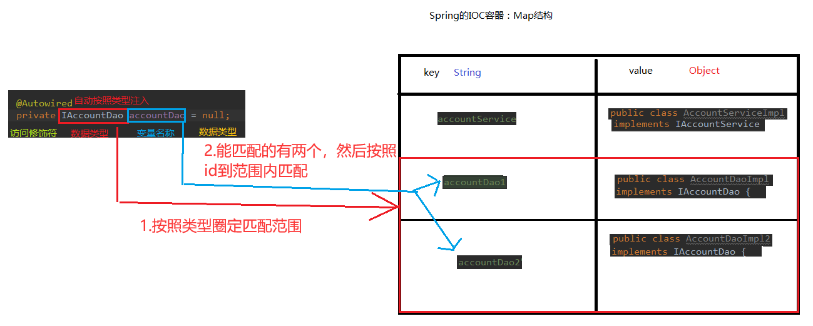
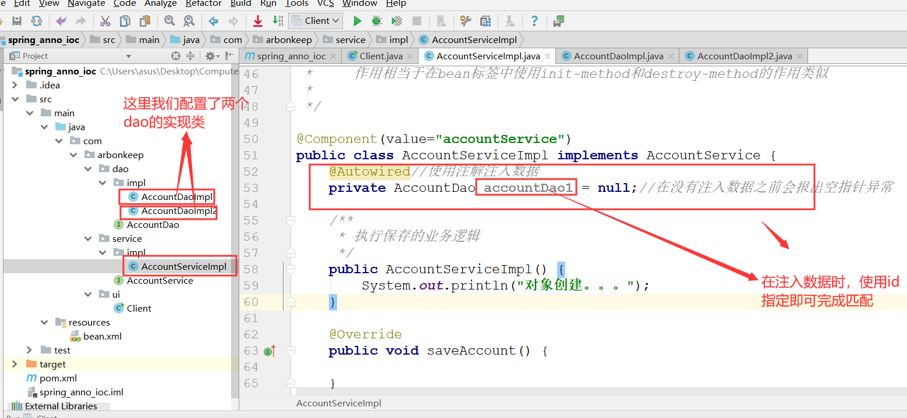
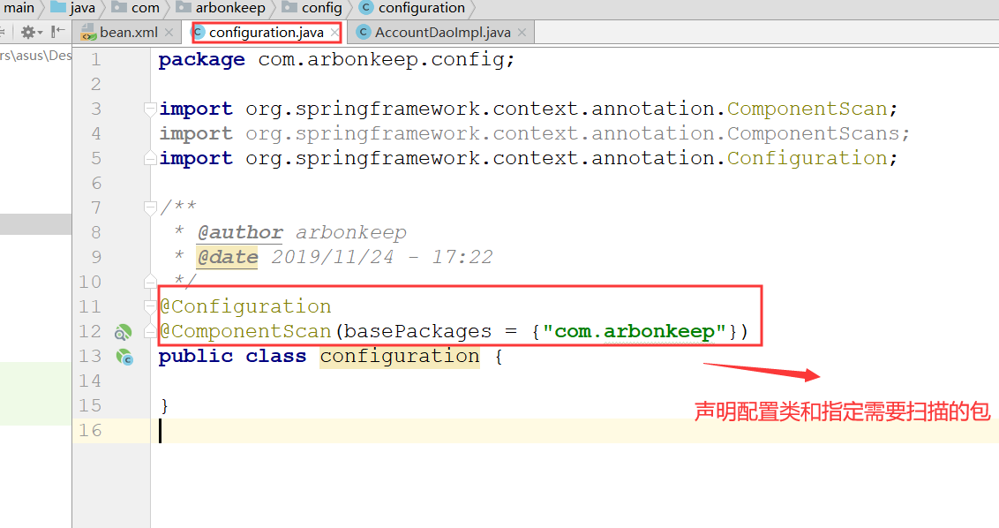
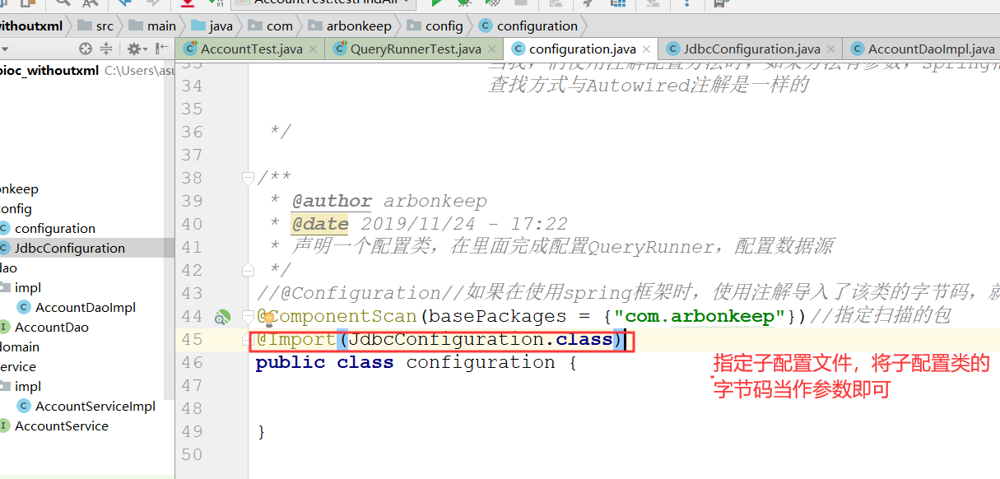
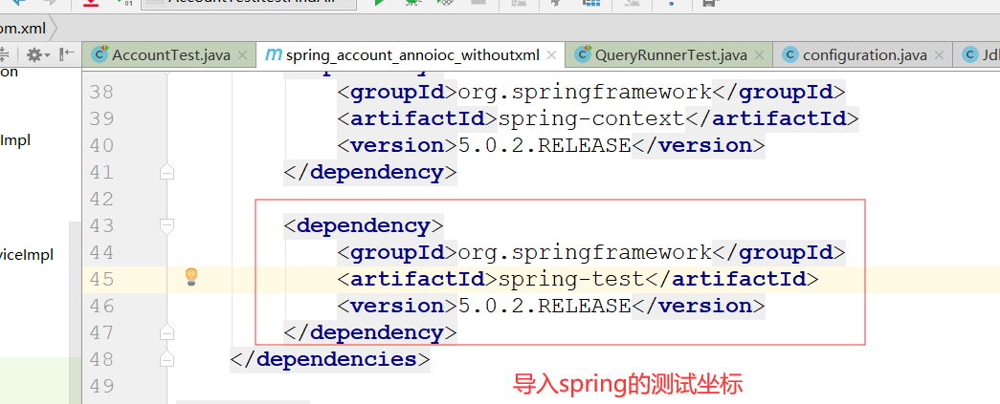
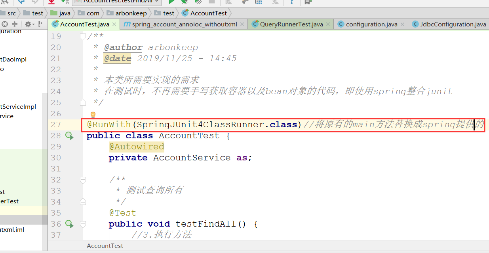
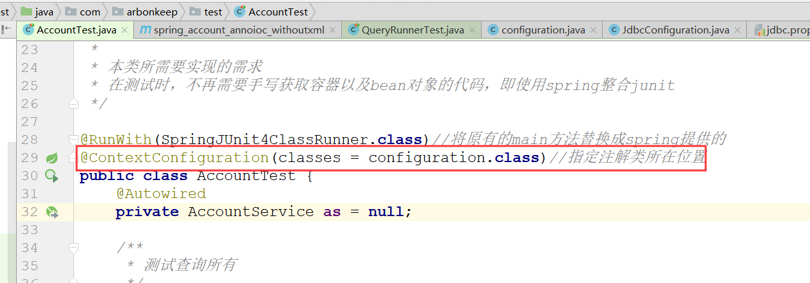

# Spring

## Spring基于注解的IOC
    1. 按照功能对注解进行分类
        <1> 用于创建对象的
            * 作用相当于在xml配置文件中编写一个<bean>标签实现的功能类似

            1) component注解：
                * 作用：用于把当前类对象存入spring容器中

                * 属性：
                    * value：用于指定bean的id。当我们不写时，它的默认值就是当前类名，首字母小写
                    
            2) Controller:一般用于表现层

            3) Service：一般用于业务层

            4) Respository:一般用于持久层

                * 以上三个注解的作用和属性都与conponent一样。它们三个是spring框架为我们提供明确的三层使用的注解，
                  使我们的三层对象更加清晰

        <2> 用于注入数据的
            * 作用相当于在xml配置文件中的bean标签中写一个<property>标签的作用类似

             1) Autowired
                * 作用：自动按照类型注入。只要容器中有唯一的一个bean对象类型和要注入的变量类型匹配，就可以注入成功
                        
                        如果ioc容器中没有任何bean的类型和要注入的变量类型匹配，则会报错。
                        
                        如果ioc容器中有多个类型匹配时：首先会按照类型圈定出能够匹配的范围，然后通过变量的名称在范
                        围内进行匹配，我们可以通过修改id的方式完成匹配

                        * 如下所示，有两个匹配的类型，那么就通过id指定，完成匹配。需要注意的是在都需要实现接口才能
                          匹配成功

                * 出现位置：可以在变量上也可以在方法上

                * 细节：在使用注解注入时，set方法就不是必要的了

            2) 基于Autowired注解需要修改id，那么就衍生出了一个与它配合使用的注解Qualifier
                * 作用：
                    在按照类中注解之上再按照名称注入。它在给类成员注入时，不能单独使用。但是在给方法参数注入时是可
                    以的

                * 属性：    
                    value：用于指定bean的id

            3) Resource注解
                * 作用：
                    直接按照bean的id注入。它可以独立使用

                * 属性：
                    name：用于指定bean的id
            
                * 以上三个注解都只能注入其它bean类型的数据，而基本数据类型和String不能使用上述注解实现。另外集合类
                  型的注入只能通过xml实现

            4) value注解
                * 作用：用于注入基本数据类型和String类型数据

                * 属性：
                    value：用于指定数据的值、它可以使用spring中的SpEL(也就是spring的EL表达式)
                           * SpEL的写法：${表达式}
                

        <3> 用于改变作用范围的
            * 作用相当于在bean标签中使用scope属性实现的功能类似
            
            1) Scope注解
                * 作用：用于指定bean的作用范围

                * 属性：
                    value：指定范围的取值，常用取值有singleton和prototype

        <4> 与生命周期相关的
            * 作用相当于在bean标签中使用init-method和destroy-method的作用类似

            1) PreDestroy注解
                * 作用：
                    用于指定销毁方法

            2) PostConstruct
                * 作用
                    用于指定初始化方法

    2. 注解的的使用需要导入spring的context依赖
        * 告知spring在创建容器时需要扫描的包，配置所需要的标签不在bean的约束中，而是一个名为context的名称空间和约
          束中

        * 需要使用:component-scan属性指定注解查找所在的包。如下所示

            <context:component-scan base-package="com.arbonkeep"></context:component-scan>

    3. 使用xml配置完成案例(参考spring_account_xmlioc)

    4. 使用注解完成案例(参考spring_account_annoioc)

    5. 完全使用注解完成account案例(参考spring_account_annoioc_withoutxml)
        <1> 如果需要使用完全注解的方式完成，那么首先需要定义一个configuration配置类

        <2> 在配置类中使用相关的注解进行配置
            1) Configuration注解
                * 作用：指定当前类是一个配置类

                * 注意：当配置类作为AnnotationConfigApplicationContext对象的创建参数时，该注解可以不写

            2) ComponentScan注解
                * 作用：用于通过注解指定spring在创建容器时所需要的包

                * 属性：
                    value：它与basePackage的作用是一样的，都是用于指定创建容器时要扫描的包
                            
                * 使用这个注解就相当于在xml配置中配置
                 <context:component-scan base-package="com.arbonkeep"></context:component-scan>

            3) bean注解
                * 作用：用于把当前的返回值作为bean对象存入spring的ioc容器中

                * 属性：
                    name：用于指定bean的id。当不写时，默认id是当前方法的名称

                * 注意：
                    当我，们使用注解配置方法时，如果方法有参数，spring框架会去容器中查找有没有可用的bean对象。
                    查找方式与Autowired注解是一样的

            4) Import注解
                * 作用：用于导入其他的配置类(导入的配置类与主配置类相当于父子关系)

                * 属性：
                    value：用于指定其他配置类的字节码
                           当我们使用Import的注解之后，含有Import注解的类就是父配置类，而导入的配置类就是子配置类

    6. 关于import注解的说明
        <1> 如果两个配置类都不想使用Configuration注解声明，那么可以把两个配置当作字节码参数传给AnnotationConfigA
            pplicationContext。但是这样两个配置就相当于平等的关系

        <2> 还可以使用import注解，在主配置类中使用import注解添加子配置类。里面可以放多个参数(字节码)

    7. PropertySource注解
        <1> 作用：用于指定properties文件的位置

        <2> 属性
            * value：指定文件的名称和路径   
                * 关键字：classpath：表示类路径下

    8. 对于使用注解还是使用xml配置文件进行配置的理解
        <1> 有时候使用全注解的方式进行配置可能还会比较麻烦。所以可以结合xml配置与注解一起使用。最好可以遵循自己写
            的类通过注解开发，使用到的jar包配置时，可以使用xml配置

    9. Spring整合junit
        <1> 原因分析
            1) 应用程序的入口
                main方法

            2) junit单元测试中，没有main方法也能执行
                junit集成了一个main方法
                该方法就会判断当前测试类中哪些方法有 @Test注解
                junit就让有Test注解的方法执行

            3) junit不会管我们是否采用spring框架
                在执行测试方法时，junit根本不知道我们是不是使用了spring框架
                所以也就不会为我们读取配置文件/配置类创建spring核心容器

            4) 由以上三点可知
                当测试方法执行时，没有Ioc容器，就算写了Autowired注解，也无法实现注入

        <2> Spring整合junit的配置
            1) 导入spring整合的junit的jar包(坐标)

            2) 使用Junit提供的一个注解把原有的main方法替换了，替换成spring提供的。需要使用@Runwith注解

            3) 告知spring的运行器spring和ioc是基于xml配置还是基于注解配置的，并且说明位置。需要使用
                @ContextConfiguration注解
                    属性：
                        location：指定xml文件的位置，需要加上classpath关键字，表示在类路径下
                        classes：指定注解所在的位置

            4) 注意：
                当我们使用spring5.0以上的版本的时候，要求junit的版本需要在4.1.2或者以上
                

        
    