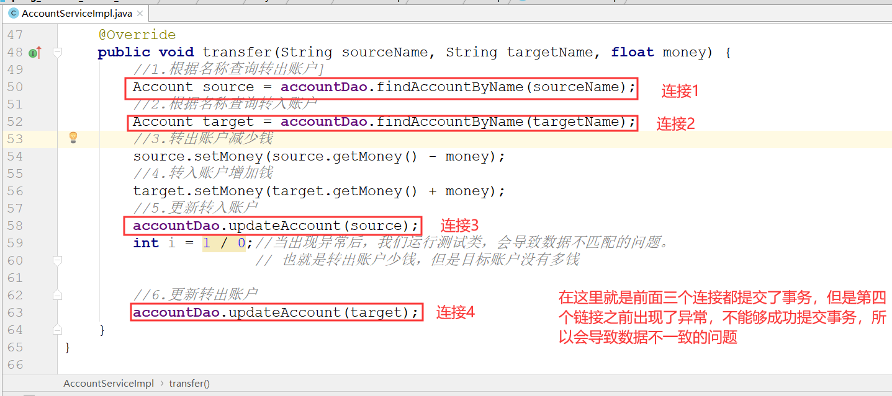
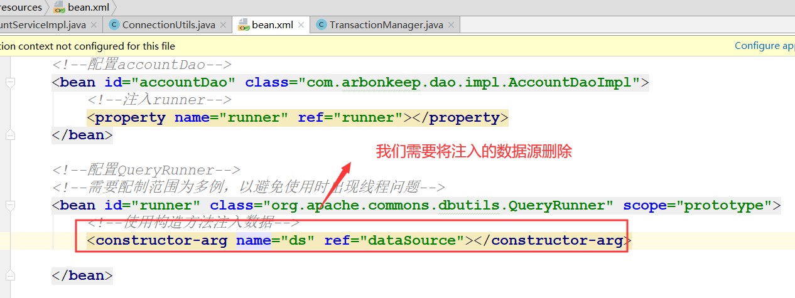
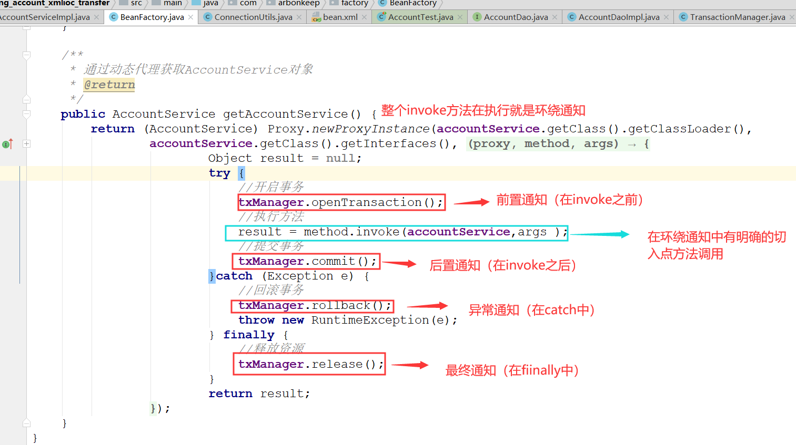
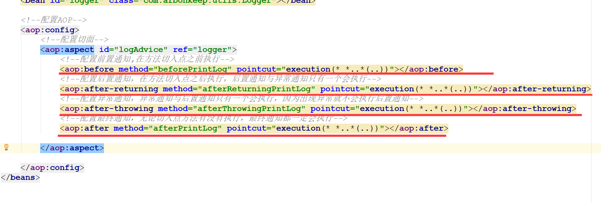

# Spring

## 事务的管理
    1. 在我们之前的account案例中完成一个transfer的转账操作
        <1> 即我们需要添加一个转账的操作(详细请参考spring_account_xmlioc_transfer)

        <2> 当我们在实现了一个转账的具体流程之后，进行测试发现，当我们在业务层出现一个异常时，会导致转账出现数据不
            匹配的问题。也就是转出账户少钱，但是目标账户没有多钱

        <3> 那么，出现这个问题的原因是：我们在业务层中并不是通过一个连接来完成对整个transfer操作的控制。而是使用了
            4个连接完成的。如果，在一个连接之前出现异常，那么后面的事务控制就会失败。不能够提交事务。如下所示

        <4> 所以我们需要使用一个连接对事务进行控制，也就是将事务从持久层转到业务层，完成所有操作。
            1) 定义获取连接的工具类(ConnectionUtils)

            2) 定义控制事务的工具类(TransactionManager)
                * 问题：在事务控制时，我们的释放资源的方法，其实是将获取到的连接返回连接池中，那么在ConnectionUtils
                        中调用getThreadConnection再次获取链接时，是存在连接的，只不过被关闭了。不能够再使用

                * 解决：在ConnectionUtils中定义一个将线程与连接解绑的方法，然后再释放资源后，并调用该方法，将线程
                        与连接解绑

            3) 在业务层完成执行逻辑的编写

            4) 在完成之执行逻辑之后，我们需要明白之前我们是注入过数据源的，而我们在使用工具类是不需要使用注入的数据源
               的。所以需要去除,那么在dao实现类中就没有了datasource

            5) 由于没有了注入的dataSource所以就没有连接，那么我们就需要注入ConnctionUtils，获取连接，然后在dao调用
               方法时，使用带有connection连接的方法完成增删改查

            6) 在bean.xml中注入其它需要注入数据的内容

## spring中的动态代理
    1. 动态代理概述
        * 特点：字节码随用随创建，随用随加载
        
        * 作用：不修改源码的基础上对方法增强
        
        * 分类：
            1) 基于接口的动态代理
            2) 基于子类的动态代理
          
    2. 基于接口的动态代理
        <1> 涉及的类：Proxy
        
        <2> 提供者：JDK官方

        <3> 如何创建代理对象：
            使用Proxy类中的newProxyInstance方法

        <4> 创建代理对象的要求：
            被代理类最少实现一个接口，如果没有则不能使用
            
        <5> newProxyInstance方法的参数：
            ClassLoader：类加载器
                它是用于加载代理对象字节码的。和被代理对象使用相同的类加载器。固定写法。

            Class[]：字节码数组
                它是用于让代理对象和被代理对象有相同方法。固定写法。

            InvocationHandler：用于提供增强的代码
                它是让我们写如何代理。我们一般都是些一个该接口的实现类，通常情况下都是匿名内部类，但不是必须的。
                此接口的实现类都是谁用谁写。

    3. 基于子类的动态代理：
        <1> 涉及的类：Enhancer

        <2> 提供者：第三方cglib库

        <3> 如何创建代理对象：
            使用Enhancer类中的create方法

        <4>创建代理对象的要求：
            被代理类不能是最终类

        <5> create方法的参数：
            Class：字节码
                它是用于指定被代理对象的字节码。
    
            Callback：用于提供增强的代码
                它是让我们写如何代理。我们一般都是些一个该接口的实现类，通常情况下都是匿名内部类，但不是必须的。
                此接口的实现类都是谁用谁写。
                我们一般写的都是Callback接口的子接口实现类：MethodInterceptor

    4. 使用动态代理实现事务的控制(参考spring_account_xmlioc_transfer中BeanFactory)

## AOP(面向切面编程)

    1. AOP的概念
        * 全称是 Aspect Oriented Programming 即：面向切面编程。

        * 简单的说它就是把我们程序重复的代码抽取出来，在需要执行的时候，使用动态代理的技术，在不修改源码的基础上，
          对我们的已有方法进行增强。

    2. 作用：在程序运行期间，不修改源码对已有方法进行增强。

    3. 优势：
        * 减少重复代码

        * 提高开发效率
        
        * 维护方便

    4. AOP 的实现方式
        * 使用动态代理技术

## Spring中的AOP

    1. AOP的相关术语
        <1> Joinpoint(连接点):
            * 所谓连接点是指那些被拦截到的点。在 spring 中,这些点指的是方法,因为 spring 只支持方法类型的连接点。
            
            * 通俗的讲，在三层架构中的业务层中接口的每个抽象方法都是一个连接点（也就是能够通过方法添加事务管理等）
        
        <2> Pointcut(切入点):
            * 所谓切入点是指我们要对哪些 Joinpoint 进行拦截的定义。

            * 通俗的讲，使用动态代理增强的方法就是一个切入点

        <3> Advice(通知/增强):
            * 所谓通知是指拦截到 Joinpoint 之后所要做的事情就是通知。

            * 通知的类型：前置通知,后置通知,异常通知,最终通知,环绕通知。

        <4> Introduction(引介):
            * 引介是一种特殊的通知在不修改类代码的前提下, Introduction 可以在运行期为类动态地添加一些方法或 
              Field。
        
        <5> Target(目标对象):
            * 代理的目标对象，即被代理对象。

        <6> Weaving(织入):
            * 是指把增强应用到目标对象来创建新的代理对象的过程。

            * spring 采用动态代理织入，而 AspectJ 采用编译期织入和类装载期织入。

        <7> Proxy（代理）:
            * 一个类被 AOP 织入增强后，就产生一个结果代理类。

        <8> Aspect(切面):
            * 是切入点和通知（引介）的结合。

    2. Spring基于xml的配置
        <1> spring中基于XML的AOP配置步骤
            1) 把通知Bean(需要增强的功能的工具类)也交给spring来管理

            2) 使用aop:config标签表明开始AOP的配置

            3) 使用aop:aspect标签表明配置切面
                    id属性：是给切面提供一个唯一标识
                    ref属性：是指定通知类bean的Id。

            4) 在aop:aspect标签的内部使用对应标签来配置通知的类型
                aop:before：表示配置前置通知
                        * method属性：用于指定Logger类中哪个方法是前置通知

                        * pointcut属性：用于指定切入点表达式，该表达式的含义指的是对业务层中哪些方法增强

                        * 切入点表达式的写法：(详细请参考spring_springAOP中的bean.xml))
                            关键字：execution(表达式)
                            表达式：
                                访问修饰符  返回值  包名.包名.包名...类名.方法名(参数列表)
                                
        <2> 关于切入点表达式的注意事项
            * 访问修饰符可以省略
                void com.arbonkeep.service.impl.AccountServiceImpl.saveAccount()

            * 返回值可以使用通配符，表示任意返回值
                * com.arbonkeep.service.impl.AccountServiceImpl.saveAccount()

            * 包名可以使用通配符，表示任意包。但是有几级包，就需要写几个*.
                * *.*.*.*.AccountServiceImpl.saveAccount())

            * 包名可以使用..表示当前包及其子包
                * *..AccountServiceImpl.saveAccount()

            * 类名和方法名都可以使用*来实现通配
                * *..*.*()

            * 参数列表：
                可以直接写数据类型：
                    基本类型直接写名称           int
                    引用类型写包名.类名的方式   java.lang.String

                可以使用通配符表示任意类型，但是必须有参数

                可以使用..表示有无参数均可，有参数可以是任意类型

            * 全通配写法：
                * *..*.*(..)

            * 实际开发中切入点表达式的通常写法：
                切到业务层实现类下的所有方法
                    * com.itheima.service.impl.*.*(..)

        <3> 4种通知的配置(如下所示)

        <4> 切入点表达式的配置
            1) 使用标签为：aop:pointcut

            2) id属性用于指定表达式的唯一标识。expression属性用于指定表达式的内容

            3) 注意：
                * 此标签写在aop:aspect标签内部只能当前切面使用

                * 它还可以写在aop:aspect标签外部，此时就说明所有的切面都能使用。但需要遵循书写格式的约束。也就是
                  必须写在切面的前面，不能写在后面
         
        <5> 环绕通知的配置(使用环绕通知可以自定义其他四个通知)
            1) 问题：
                当我们配置了环绕通知之后，切入点方法没有执行，而通知方法执行了。

            2) 分析：
                通过对比动态代理中的环绕通知代码，发现动态代理的环绕通知有明确的切入点方法调用，而我们的代码中没有。

            3) 解决：
                * Spring框架为我们提供了一个接口：ProceedingJoinPoint。该接口有一个方法proceed()，此方法就相当于明
                  确调用切入点方法。该接口中有一个getArgs方法，该方法可以获取执行的参数

                * 该接口可以作为环绕通知的方法参数，在程序执行时，spring框架会为我们提供该接口的实现类供我们使用。

            4) spring中的环绕通知：
                它是spring框架为我们提供的一种可以在代码中手动控制增强方法何时执行的方式。

            5) 配置使用aop:around标签

## AOP补充
    1. 使用xml配置Aop完成对事务的控制(参考spring_aoptx_xml)

    2. 使用注解的aop完成对事务的控制(参考spring_aoptx_anno)

    3. 关于在使用aop完成对事务控制中所遇到的问题(实现请参考spring_aoptx_anno中trasactionManager)
        <1> 当我们完成了基本的注解配置之后，运行test类发现会出现一个异常。即：
            can't call commit when autocommit = true

        <2> 产生这个问题的原因是什么呢？
            * 这是由于在执行程序时，会先执行最终通知然后再执行后置通知，那么也就是说，资源已经释放，即
              autocommit已经置为true了。

        <3> 产生上面问题的主要原因就是我们在实现spring中使用aop实现事务的控制时，我们使用4个通知注解类型，
            它们之间的执行顺序是存在问题的。那么，如果我们一定需要使用aop注解实现事务的控制的话，我们就应
            该使用环绕通知，因为环绕通知是自定义的，它不会存在执行顺序的问题

