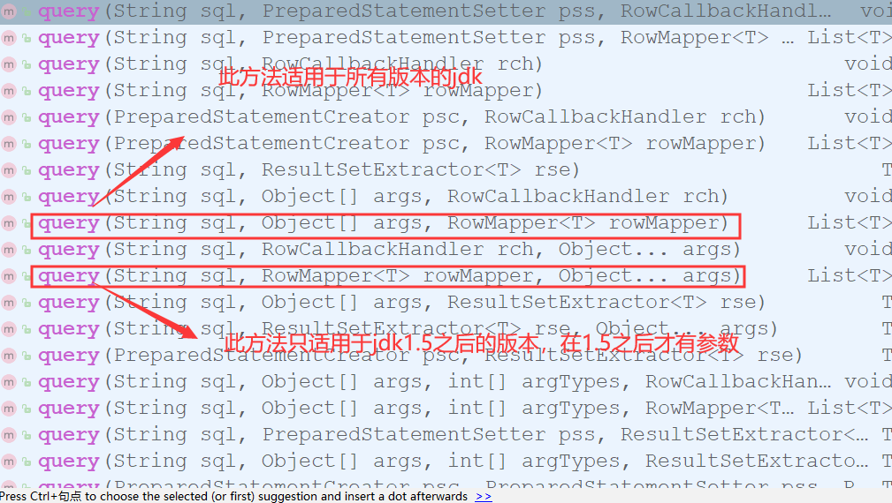
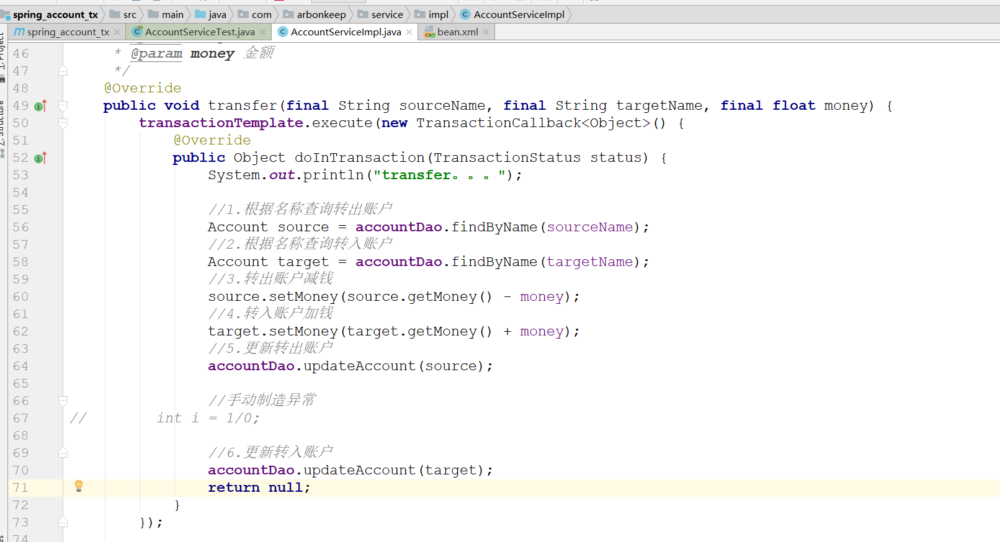

# Spring

## JDBC Template
    1. JdbcTemplate的作用：
		* 它就是用于和数据库交互的，实现对表的CRUD操作

    2. 实现CRUD操作的方式(请参考spring_jdbctemplate01)
        * 注意
            <1> 查询所有中一般使用query方法中的两个具体的有相关参数的方法
                

            <2> 其中RowMapper参数一般会使用Spring提供的BeanPropertyRowMapper，当然也可以自己去完成Account对结果集
                的封装
                
            <3> 增删改都可以使用update方法完成

    3. JdbcTemplate在DAO持久层的使用(请参考spring_jdbctemplate01下的dao层)

    4. 如果有多个dao的实现类，如何将实现类中共同的代码提取出来？
        <1> JdbcDaoSupport的使用
            1) 自定义一个JdbcDaoSupport类，将公共代码放在该类中，同时可以添加一个创建JdbcTemplate的方法。

            2) 不需要自定JdbcDaoSupport，可以直接使用spring提供的。不利于注解注入数据

        <2> dao实现类的两种编写方式
            1) 继承JdbcDaoSupport使用spring提供的

            2) 自己定义jdbcTemplate，有利于注解开发

## Spring中的事务控制
    1. 基于xml完成事务的配置(参考spring_tx_xml01)
        <1> spring中基于xml声明事务的配置实现步骤
            1) 配置事务管理器
            
            2) 配置事务的通知
                * 我们需要导入事务的约束，tx名称空间和约束，同时也需要aop的约束

                * 使用tx:advice标签配置事务通知
                    * 属性：
                        - id : 为事务通知声明一个唯一标识

                        - transaction-manager：为事务通知指定一个事务管理器的引用

            3) 配置aop中的切入点表达式

            4) 建立事务通知和切入点表达式的关联
                * 使用aop:advisor标签，advice-ref属性指定通知的id，pointcut-ref属性指定切入点表达式的id

            5) 配置事务的属性
                * 是在事务的通知tx:advice标签内部进行配置
                    - 使用tx:atrribute标签进行配置，在tx:method标签内部使用相关属性配置

                    - tx:method标签内部的name:用于指定方法名(指定哪个方法需要配置相关属性)

                * tx:atrribute标签的几个属性
        
                    - isolation:用于指定事务的隔离级别。默认值是DEFAULT,表示使用数据库的默认隔离级别

                    - propagation:用于指定事务的传播行为，默认值是REQUIRED,表示一定会有事务，增删改的选择，查询方法
                                  可以使用SUPPORTS
                    
                    - read-only:用于指定事务是否只读，只有查询方法才设置为true。默认值是false，表示读写

                    - timeout：用于指定事务的超时时间，默认值是-1，表示永不超时，如果指定了数值，以秒为单位

                    - rollback-for：用于指定一个异常，当产生该异常时，事务回滚，产生其他异常时，事务不回滚。没有默认
                                    值。表示任意异常都回滚

                    - no-rollback- for：用于指定一个异常，当该异常发生时，事务不回滚，产生其它异常时，事务回滚。没有
                                        默认值。表示任意异常都回滚

    2. 基于注解完成事务的配置(参考spring_tx_anno01)
        <1> spring中基于注解声明事务的配置实现步骤            
            1) 配置事务管理器

            2) 开启spring对注解事务的支持

            3) 找到需要事务支持的地方使用@Transactional注解
                * 可以找注解内部指定相关属性

    3. 使用全注解方式实现事务的控制(参考spring_anno_tx_withoutxml)
        <1> 相关注解的整合
            1) @Configuration:声明该类为配置类

            2) @ComponentScan:指定需要扫描的包

            3) @Import：指定要导入的相关类，里面传入的是字节码

            4) @Bean:将内容加载入spring容器

            5) @Value:获取到指定键的值

            6) @PropertySource:指定配置文件

            7) @EnableTransactionManagement:开启spring支持注解

    4. 编程式事务控制的实现(参考spring_account_tx)
        <1> 可以使用Transdactiontemplate模板类来完成编程式的事务控制
            1) 需要配置事务管理器

            2) 配置事务管理器模板

            3) 在业务层使用模板对象
                * 在执行每一个业务逻辑时都需要使用该模板对象。使用如下所示

        <2> 存在问题
            1) 每一次执行业务逻辑，都需要将执行逻辑写在TransactionCallback的匿名内部类中，这样就会导致重复代码过多。所
               以一般我们都不使用这种方式

    