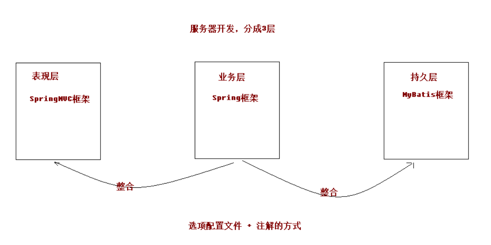
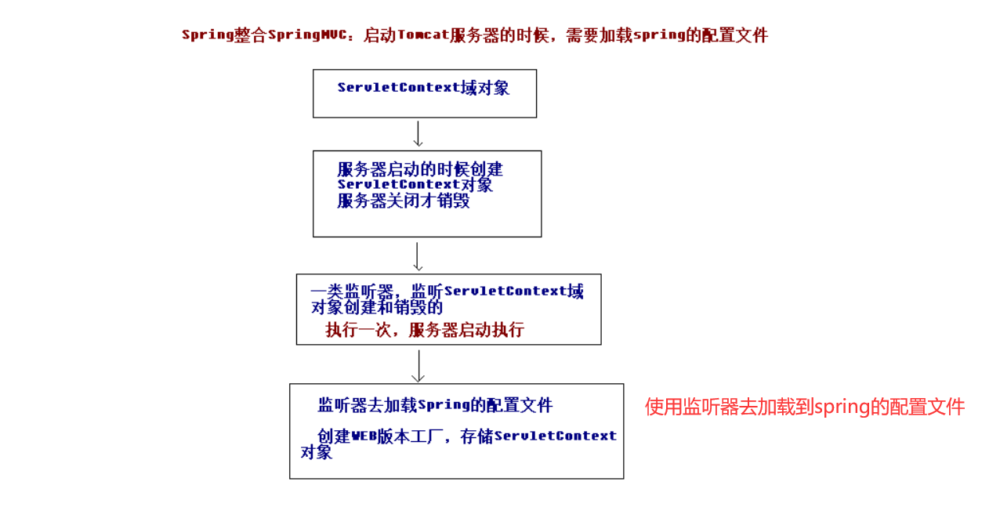

# SSM整合

## SSM整合说明
    1. 整合架构原理
        <1> ssm整合是使用Spring去整合Spring MVC和Mybatis 

        <2> 一般使用xml还是注解会遵循怎么简单就使用哪个方式

 

    2. 整合环境的搭建(参考ssm_01)
        <1> 创建需要使用的数据库

        <2> 导入相关的jar包
            * 相关jar包：spring-webmvc、spring-jdbc、spring-tx、aspectjweaver、mybatis、mybatis-spring
                        mysql-connector-java、c3p0、javax.servlet-api、jsp-api

        <3> 完成dao，domain，service，controller的编写
 
## SSM整合的实现步骤（使用xml与annotation结合的方式）

### Spring框架的整合
        
        <1> 创建spring的xml配置文件：applicationContext.xml
            1) 导入相关约束

``` xml
                    <?xml version="1.0" encoding="UTF-8"?>
                    <beans xmlns="http://www.springframework.org/schema/beans"
                    xmlns:xsi="http://www.w3.org/2001/XMLSchema-instance"
                    xmlns:context="http://www.springframework.org/schema/context"
                    xmlns:aop="http://www.springframework.org/schema/aop"
                    xmlns:tx="http://www.springframework.org/schema/tx"
                    xsi:schemaLocation="http://www.springframework.org/schema/beans
                    http://www.springframework.org/schema/beans/spring-beans.xsd
                    http://www.springframework.org/schema/context
                    http://www.springframework.org/schema/context/spring-context.xsd
                    http://www.springframework.org/schema/aop
                    http://www.springframework.org/schema/aop/spring-aop.xsd
                    http://www.springframework.org/schema/tx
                    http://www.springframework.org/schema/tx/spring-tx.xsd">

                    </beans>


```

            2) 开启注解需要扫描的包
                * 注意：这里需要配置注解扫描不需要扫描的包

```xml

    <!--开启注解需要扫描的包
        由于我们只需要处理service和dao，不需要controller，所以不需要扫描controller
        -->
    <context:component-scan base-package="com.arbonkeep">
        <!--配置controller不需要扫描-->
        <context:exclude-filter type="annotation" expression="org.springframework.stereotype.Controller"/>
        
    </context:component-scan>

```

            3) 使用注解的方式配置service类

### 编写SpringMVC框架
        
        <1> 配置前端控制器(web.xml)

```xml
    <servlet>
    <servlet-name>dispatcherServlet</servlet-name>
    <servlet-class>org.springframework.web.servlet.DispatcherServlet</servlet-class>
    <init-param>
    <!--指定加载springmvc.xml配置文件-->
    <param-name>contextConfigLocation</param-name>
    <param-value>classpath:springmvc.xml</param-value>
    </init-param>
    <!-- 启动服务器，创建servlet -->
    <load-on-startup>1</load-on-startup>
    </servlet>

    <servlet-mapping>
        <servlet-name>dispatcherServlet</servlet-name>
        <url-pattern>/</url-pattern>
    </servlet-mapping>

```

        <2> 配置中文乱码过滤器(web.xml)

```xml

    <filter>
    <filter-name>characterEncodingFilter</filter-name>
    <filter-class>org.springframework.web.filter.CharacterEncodingFilter</filter-class>
    <init-param>
      <param-name>encoding</param-name>
      <param-value>UTF-8</param-value>
    </init-param>
    </filter>

    <filter-mapping>
        <filter-name>characterEncodingFilter</filter-name>
        <url-pattern>/*</url-pattern>
    </filter-mapping>

```

        <3> 创建springmvc.xml配置文件
            1) 导入相关约束
            
```xml

                    <?xml version="1.0" encoding="UTF-8"?>
                    <beans xmlns="http://www.springframework.org/schema/beans"
                    xmlns:mvc="http://www.springframework.org/schema/mvc"
                    xmlns:context="http://www.springframework.org/schema/context"
                    xmlns:xsi="http://www.w3.org/2001/XMLSchema-instance"
                    xsi:schemaLocation="
                    http://www.springframework.org/schema/beans
                    http://www.springframework.org/schema/beans/spring-beans.xsd
                    http://www.springframework.org/schema/mvc
                    http://www.springframework.org/schema/mvc/spring-mvc.xsd
                    http://www.springframework.org/schema/context
                    http://www.springframework.org/schema/context/spring-context.xsd">

                    </bean>

```
            2) 配置需要扫描的包，此时只需要扫描controller

```xml

    <!--配置需要扫描的包-->
    <context:component-scan base-package="com.arbonkeep">
        <!--只扫描controller-->
        <context:include-filter type="annotation" expression="org.springframework.stereotype.Controller"/>
    </context:component-scan>

```
            3) 配置视图解析器，设置静态资源不过滤，以及开启SpringMVC对注解的支持

```xml

    <!--配置视图解析器-->
    <bean id="internalResourceViewResolver" class="org.springframework.web.servlet.view.InternalResourceViewResolver">
        <!--指定路径-->
        <property name="prefix" value="/WEB-INF/pages/"/>
        <!--指定后缀名-->
        <property name="suffix" value=".jsp"></property>
    </bean>

    <!--配置不过滤静态资源-->
    <mvc:resources location="/css/" mapping="/css/**" />
    <mvc:resources location="/images/" mapping="/images/**" />
    <mvc:resources location="/js/" mapping="/js/**" />
    
    <!--配置开启springmvc对注解的支持-->
    <mvc:annotation-driven></mvc:annotation-driven>

```

            4) 完成Controller的编写，前端页面的编写以及跳转页面的编写

### Spring整合SpringMVC

        <1> 整合的原理
            * 在启动Tomcat服务器时就需要加载Spring的配置文件，使用监听器完成对spring配置的加载



        <2> 整合的步骤
            1) 配置一个监听器(web.xml)
                * 需要注意的是：监听器默认只会加载WEB-INF目录下的applicationContext.xml配置文件因此，有两种方法
                  解决
                    - 方案一： 复制一个applicationContext.xml放在该目录下
                    - 方案二： 通过配置参数完成加载

```xml

    <!--配置Spring的监听器-->
    <listener>
    <listener-class>org.springframework.web.context.ContextLoaderListener</listener-class>
    </listener>
    <!--设置配置文件的路径, 通过配置参数完成加载-->
    <context-param>
        <param-name>contextConfigLocation</param-name>
        <param-value>classpath:applicationContext.xml</param-value>
    </context-param>

```
            2) 配置完成后，spring和springmvc的配置文件都在容器中，那么就可以将service注入到 Controller中，即可
               调用方法执行。

### 编写Mybatis框架
       
        <1>  编写主配置文件sqlMapConfig.xml配置文件

```xml
    <?xml version="1.0" encoding="UTF-8"?>
    !DOCTYPE configuration
            PUBLIC "-//mybatis.org//DTD Config 3.0//EN"
            "http://mybatis.org/dtd/mybatis-3-config.dtd">

    <configuration>

        <!--配置环境-->
        <environments default="mysql">
            <environment id="mysql">
                <transactionManager type="JDBC"></transactionManager>
                <dataSource type="UNPOOLED">
                    <!--配置数据库的基本信息-->
                    <property name="driver" value="com.mysql.jdbc.Driver"></property>
                    <property name="url" value="jdbc:mysql://localhost:3306/ssm"></property>
                    <property name="username" value="root"></property>
                    <property name="password" value="root"></property>
                </dataSource>
            </environment>
        </environments>

        <!--配置映射配置文件(我们使用注解使用class属性即可，同样可以写包名)-->
        <mappers>
            <mapper class="com.arbonkeep.dao.AccountDao"></mapper>
            <!--该包下的所有接口都能够使用-->
            <package name="com.arbonkeep"></package>
        </mappers>

    </configuration>

``` 

### Spring整合Mybatis框架

        <1> 整合的核心就是直接在Spring的配置文件中将Mybatis的sqlSessionFactory配置上

        <2> 在spring的配置文件中完成Mybatis的整合

```xml

     <!--Spring整合Mybatis-->
    <!--配置连接池(数据源)-->
    <bean id="dataSource" class="com.mchange.v2.c3p0.ComboPooledDataSource">
        <property name="driverClass" value="com.mysql.jdbc.Driver"></property>
        <property name="jdbcUrl" value="jdbc:mysql://localhost:3306/ssm"></property>
        <property name="user" value="root"></property>
        <property name="password" value="root"></property>
    </bean>
    
    <!--配置SqlSessionFactory-->
    <bean id="sqlSessionFactory" class="org.mybatis.spring.SqlSessionFactoryBean">
        <property name="dataSource" ref="dataSource"></property>
    </bean>
    
    <!--配置AccountDAO接口所在的包-->
    <bean id="mapperScanner" class="org.mybatis.spring.mapper.MapperScannerConfigurer">
        <property name="basePackage" value="com.arbonkeep.dao"></property>
    </bean>

```

### Spring整合Mybatis框架配置事务

        <1> 配置spring框架的声明式事务管理器(直接在spring的配置文件中完成配置)

```xml

    <!--配置Spring支持事务的管理-->
    <!--配置事务管理器-->
    <bean id="TransactionManager" class="org.springframework.jdbc.datasource.DataSourceTransactionManager">
        <property name="dataSource" ref="dataSource"></property>
    </bean>
    <!--配置事务通知-->
    <tx:advice id="txAdivice" transaction-manager="TransactionManager">
        <tx:attributes>
            <tx:method name="find*" read-only="true"/>
            <tx:method name="*" isolation="DEFAULT"/>
        </tx:attributes>
        
    </tx:advice>    
    <!--配置aop-->
    <aop:config>
        <aop:advisor advice-ref="txAdivice" pointcut="execution(* com.arbonkeep.service.impl.*.*(..))"/>
    </aop:config>

```


