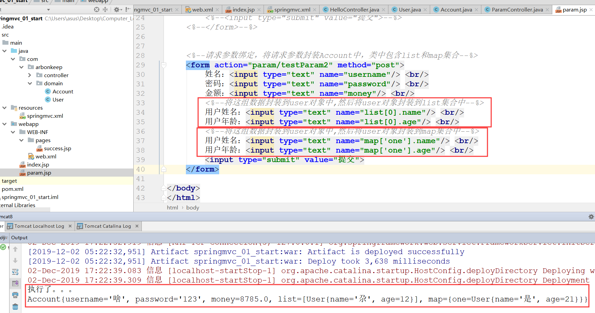
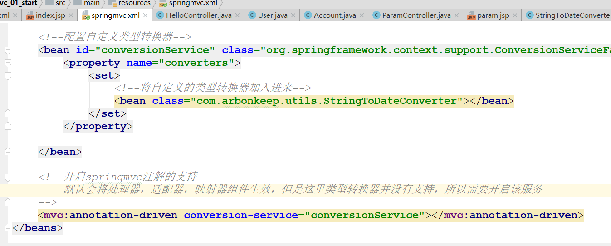
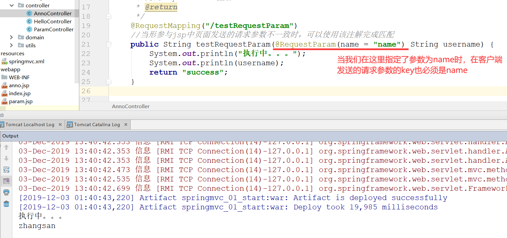
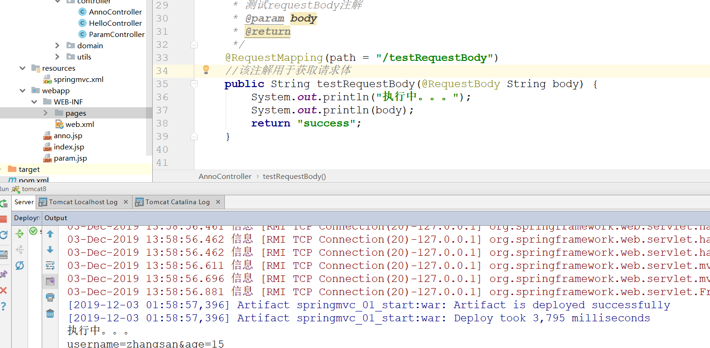
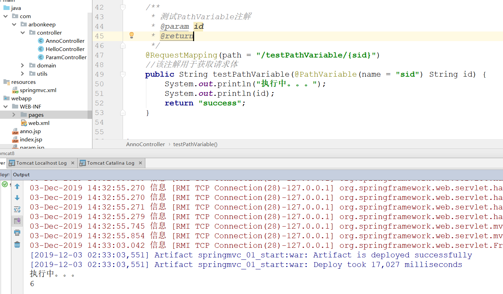
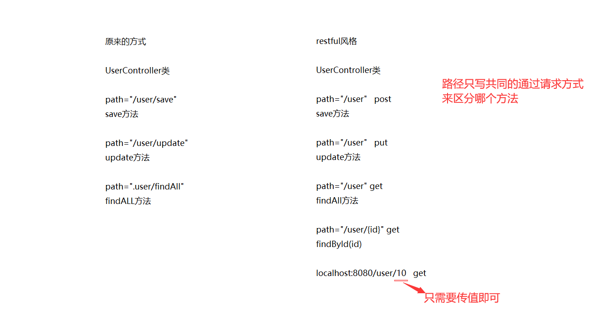
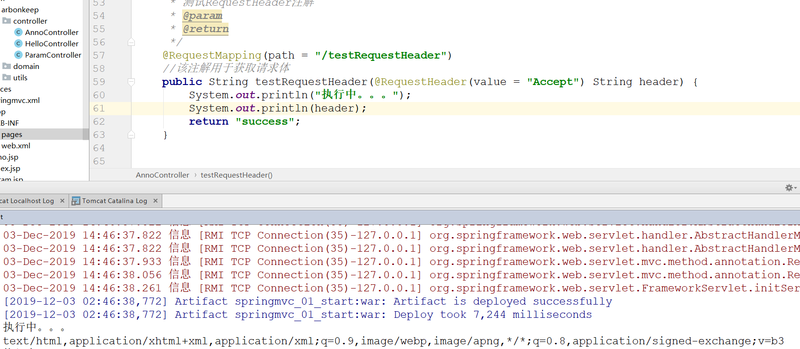
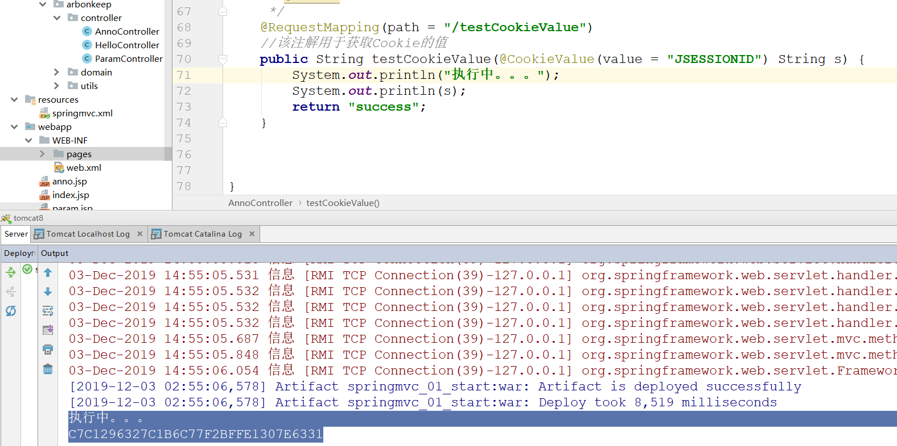
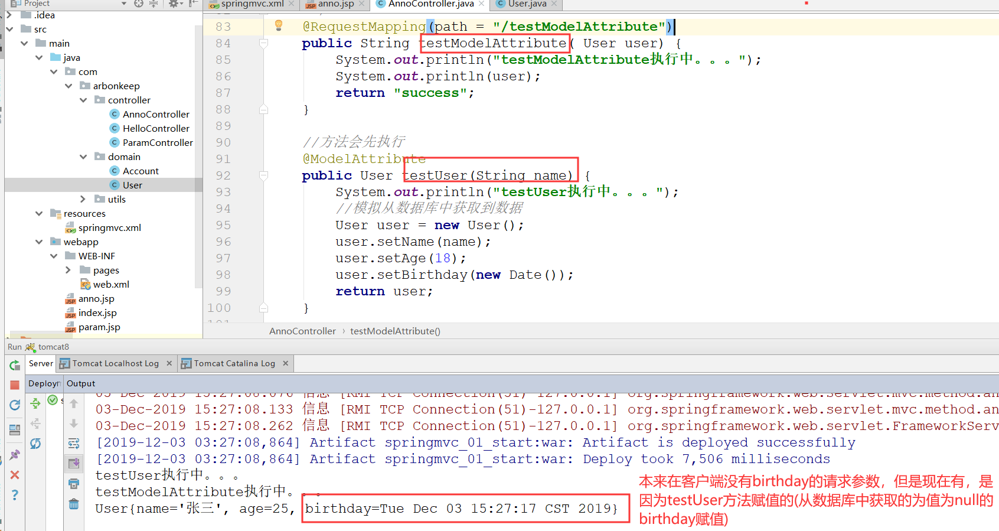
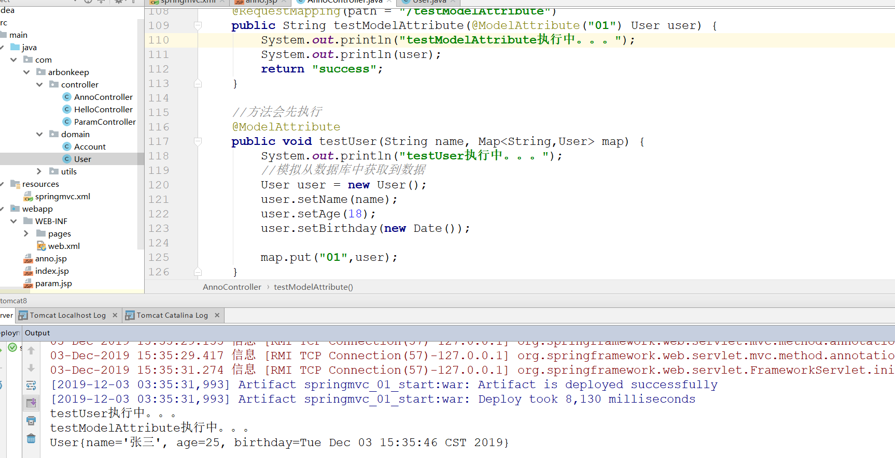

# SpringMVC

## 三层架构以及MVC设计模型介绍

## SpringMVC的入门
    1.入门相关的信息。如下

    2. 项目环境的搭建
        <1> 创建maven工程，注意：可增加一组键值对，提高maven构建速度
            * 如下所示

        <2> 创建WEB工程，引入开发的jar包

        <3> 配置核心的控制器（配置DispatcherServlet）

        <4> 编写springmvc.xml的配置文件

        <5> 部署tomcat服务器

        <5> 编写index.jsp和HelloController控制器类

    3. 入门程序的执行流程详解(参照springmvc_01_start)

        <1> 基本流程分析

        <2> 详细流程分析

    4. RequestMapping注解
        <1> 基本使用：
            1) 作用是建立请求URL和处理方法之间的对应关系

            2) 可以作用在类上或者是方法上。

            3) 如果在类上和方法上都声明了该注解并指定了path，那么在指定超链接时，就需要将两个路径连接起来，中间使用/
               连接

        <2> RequestMapping注解中的属性
            1) path 指定请求路径的url

            2) value value属性和path属性是一样的

            3) method 指定该方法的请求方式

            4) params 指定限制请求参数的条件。当指定了某个参数之后，在请求时，就必须要有该参数，才能成功。要求请求参
                      数的 key 和 value 必须和配置的一模一样。

            5) headers 发送的请求中必须包含的请求头

## 请求参数的绑定
    1. 请求参数绑定的概念
        <1> 就是指在用户发送请求时，将请求中的请求参数获取的过程

        <2> 在springMVC框架中，如果满足用户的请求参数的键与方法中的参数名一致，那么，只需要在指定的请求方法中加入对
            的参数，即可自动将请求参数获取到(底层是通过反射的方式赋值的)

            * 如下所示，当我们指定了请求参数为username和password，并在对应的方法中指定了这两个参数，最终访问param.
              jsp时打印的结果如下，正是我们所指定的

    2. 将请求参数封装到javaBean对象中
        <1> 如果需要将请求参数封装到javabean对象中，那么，javabean封装类中的属性必须与请求参数的key对应。如果封装
            类中有其它java bean对象，如果需要封装那么需要使用(bean对象名.bean属性)指定

            * 如下所示，account中封装user对象，那么如果需要完全封装的话，就需要使用如下方式

        

    3. 解决中文乱码问题
        <1> 当我们在上述表单中提交中文的请求参数时会出现中文乱码问题。可以使用springMVC中过滤器解决

            * 在web.xml中配置过滤器即可解决

    4. javabean封装类中有集合对象，如何完成请求参数的封装？
        <1> 按照如下方式完成封装即可

 注意无论怎样封装，对应的属性名一定要与请求参数一致

    5. 自定义类型转换器
        <1> 描述：即当我们在客户端提交的数据类型是字符串时，会将对应的类型进行转换，比如：我们封装的是Date类型，它会
            将字符串自动转换为Date类型(前提是字符串日期格式需要是以"/"分割，不能以"-"分割。注意：不同电脑的情况不同
            我的支持后者不支持前者)

        <2> 那么应该如何解决这一问题呢？可以自定义一个类型转换器
            1) 自定义一个将字符串转换为日期类型的工具类

            2) 在springmvc.xml中配置自定义类型转换器

     6. 获取Request以及Response原生对象
        <1> 只需要在controller类的方法中添加想要获取的参数即可
        
## 常用注解
    1. RequestParam注解(参考springmvc_01_start中anno相关内容)
        <1> 作用：
            * 把请求中指定名称的参数给控制器中的形参赋值。

        <2> 属性：
            * value：请求参数中的名称。

            * name:与value属性作用一样

            * required：请求参数中是否必须提供此参数。默认值：true。表示必须提供，如果不提供将报错。    

    2. RequestBody注解
        <1> 作用：
            * 用于获取请求体内容。直接使用得到是 key=value&key=value...结构的数据。
            
            * get 请求方式不适用。get请求没有请求体，包含在请求路径中
       
        <2> 属性：
            * required：是否必须有请求体。默认值是:true。当取值为 true 时,get 请求方式会报错。如果取值为 false，
                        get 请求得到是 null。

    3. PathVaribale注解
        <1> 作用：
            * 用于绑定 url 中的占位符。例如：请求 url 中 /delete/{id}，这个{id}就是 url 占位符。
                
            * url 支持占位符是 spring3.0 之后加入的。是 springmvc 支持 rest 风格 URL 的一个重要标志。

        <2> 属性：
            * value：用于指定 url 中占位符名称。
            
            * required：是否必须提供占位符

        <3> 补充restful风格

    4. RequestHeader注解
        <1> 作用：
            * 用于获取请求消息头。

        <2> 属性：
            * value：提供消息头名称
            
            * required：是否必须有此消息头

    5. CookieValue注解
        <1> 作用：
            * 用于把指定 cookie 名称的值传入控制器方法参数。

        <2> 属性：
            * value：指定 cookie 的名称。

            * required：是否必须有此 cookie

    6. ModelAttribute注解
        <1> 作用：
            * 该注解是 SpringMVC4.3 版本以后新加入的。它可以用于修饰方法和参数。

            * 出现在方法上，表示当前方法会在控制器的方法执行之前，先执行。它可以修饰没有返回值的方法，也可以修饰有
              具体返回值的方法。

            * 出现在参数上，获取指定的数据给参数赋值。

        <2> 属性：
            * value：用于获取数据的 key。key 可以是 POJO 的属性名称，也可以是 map 结构的 key。

        <3> 应用场景：
            * 当表单提交数据不是完整的实体类数据时，保证没有提交数据的字段使用数据库对象原来的数据。
            
            例如：
                我们在编辑一个用户时，用户有一个创建信息字段，该字段的值是不允许被修改的。在提交表单数据是肯定没有
                此字段的内容，一旦更新会把该字段内容置为 null，此时就可以使用此注解解决问题。

        <4> 举例：
            1) 测试有返回值的类型
                * 使用user类，我们在客户端请求参数中只使用name和age属性，不会使用birthday属性，当我们在其他方法
                  使用该注解后，会先执行其他方法，那么在那个方法中可以获取数据的user的birthday属性，然后给其赋值
                  当我们执行后，即使在那个方法中设置了age和name，也不会覆盖获取到的请求参数，但是，birthday没有
                  值，所以会被覆盖

            2) 测试没有的类型(执行依然成功)
                * 需要使用map，使用该注解修饰user对象，然后从集合中取出对象

        
    7. SessionAttributes注解
        <1> 作用：
            * 用于多次执行控制器方法间的参数共享。

        <2> 属性：
            * value：用于指定存入的属性名称

            * type：用于指定存入的数据类型。
