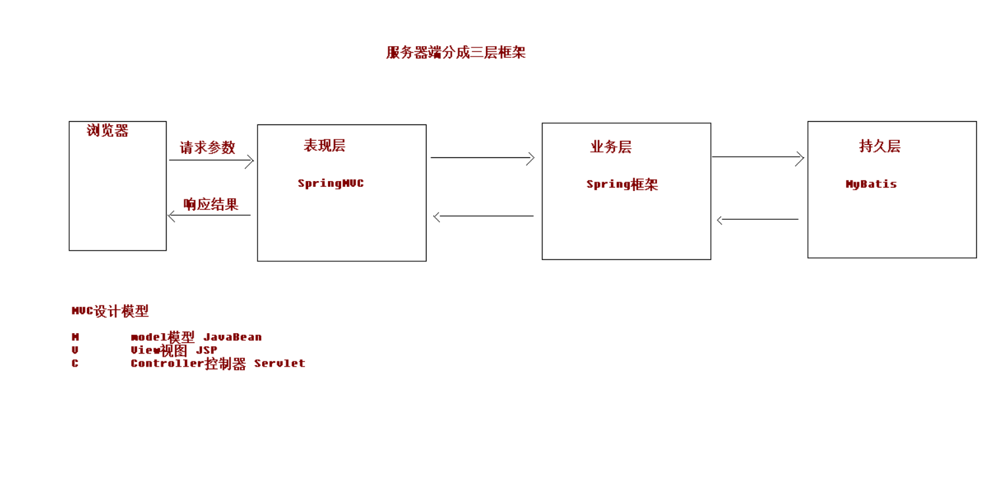
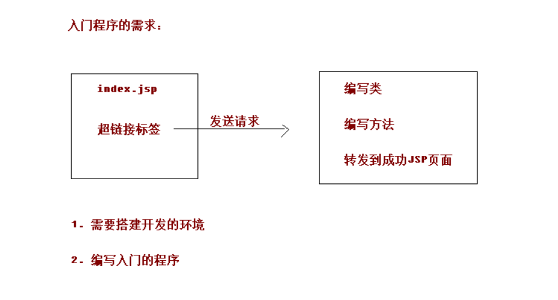
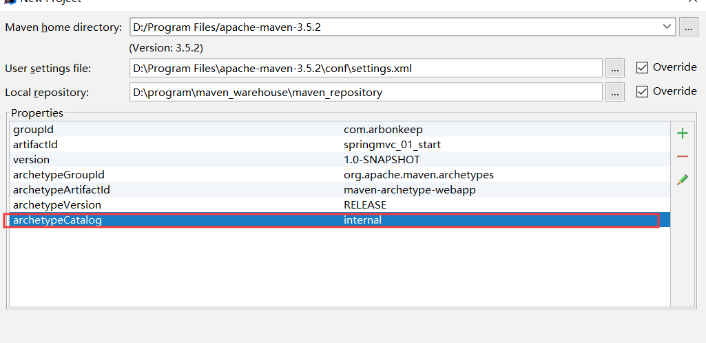
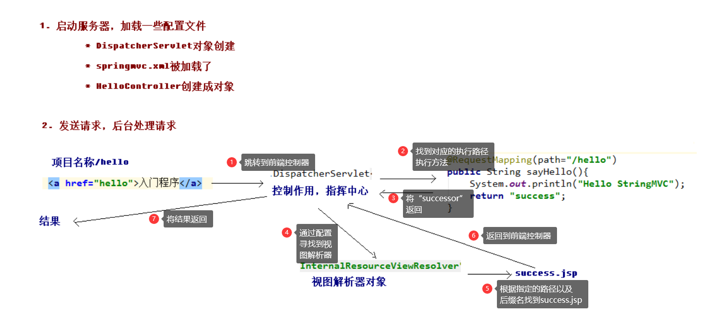
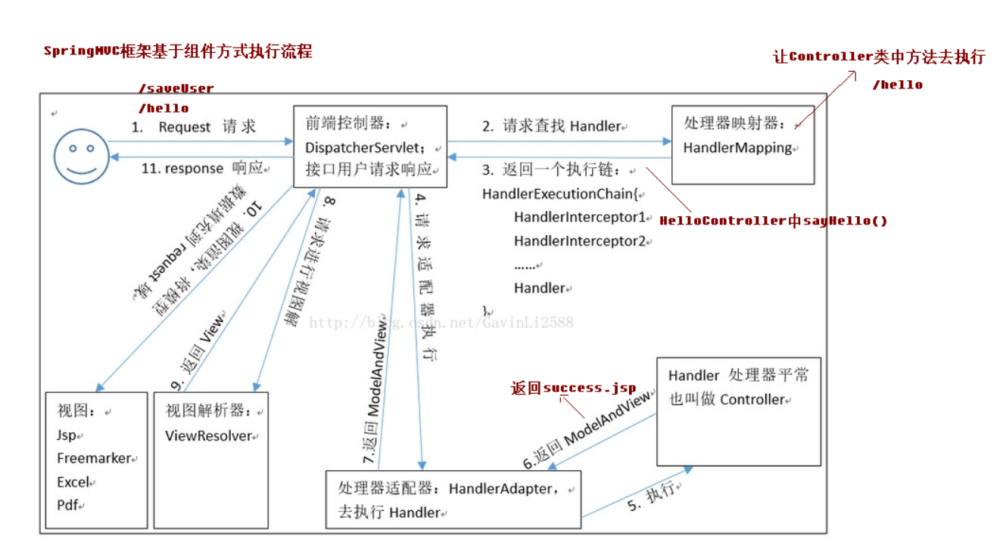
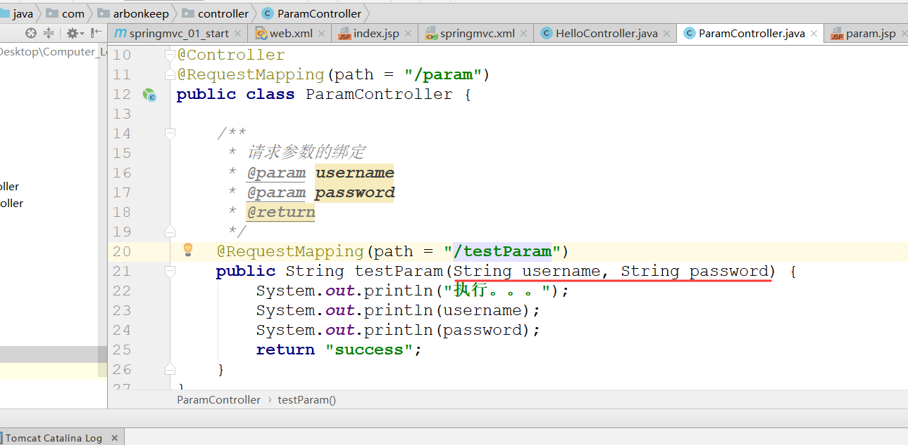
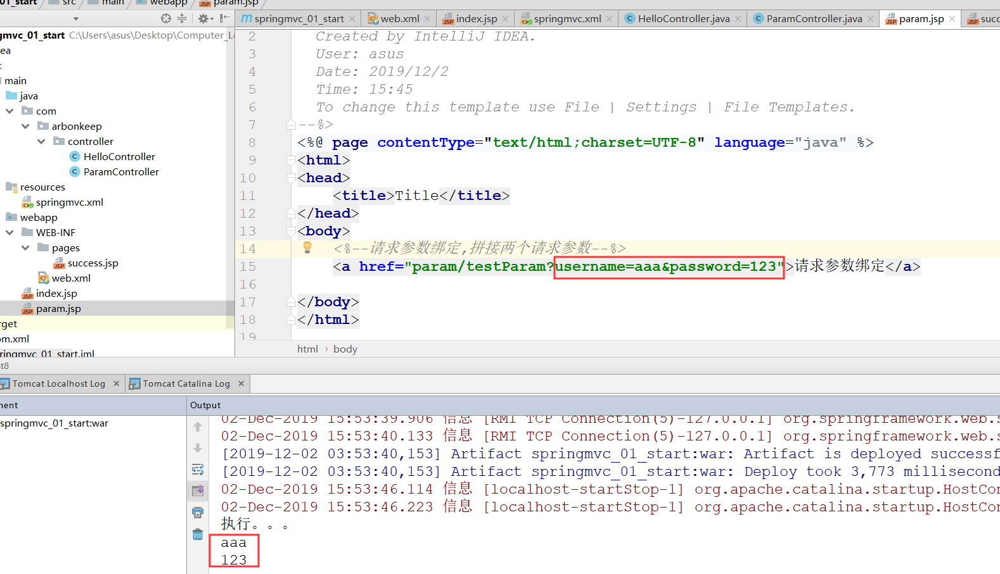
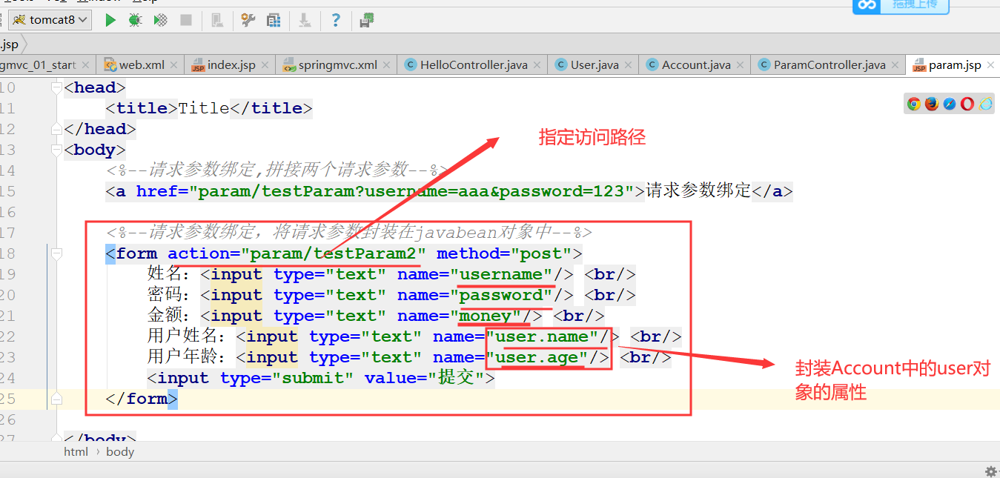
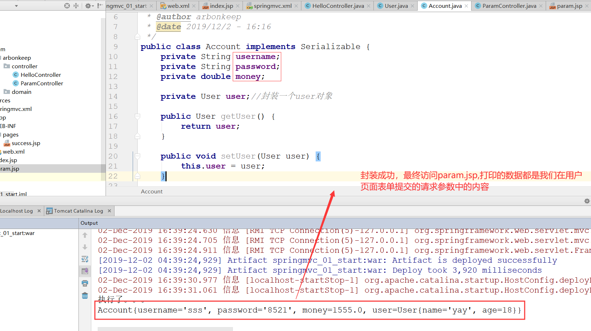
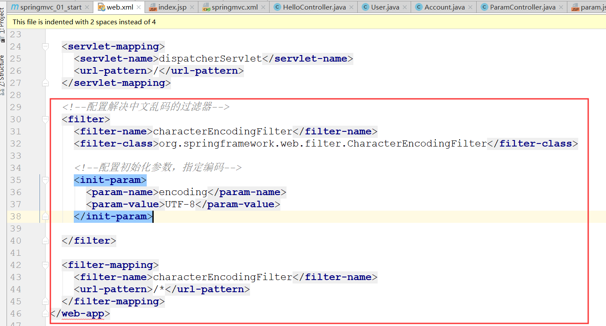

# SpringMVC

## 三层架构以及MVC设计模型介绍

## SpringMVC的入门
    1.入门相关的信息。如下

    2. 项目环境的搭建
        <1> 创建maven工程，注意：可增加一组键值对，提高maven构建速度
            * 如下所示

        <2> 创建WEB工程，引入开发的jar包

        <3> 配置核心的控制器（配置DispatcherServlet）

        <4> 编写springmvc.xml的配置文件

        <5> 部署tomcat服务器

        <5> 编写index.jsp和HelloController控制器类

    3. 入门程序的执行流程详解(参照springmvc_01_start)

        <1> 基本流程分析

        <2> 详细流程分析

    4. RequestMapping注解
        <1> 基本使用：
            1) 作用是建立请求URL和处理方法之间的对应关系

            2) 可以作用在类上或者是方法上。

            3) 如果在类上和方法上都声明了该注解并指定了path，那么在指定超链接时，就需要将两个路径连接起来，中间使用/
               连接

        <2> RequestMapping注解中的属性
            1) path 指定请求路径的url

            2) value value属性和path属性是一样的

            3) method 指定该方法的请求方式

            4) params 指定限制请求参数的条件。当指定了某个参数之后，在请求时，就必须要有该参数，才能成功。要求请求参
                      数的 key 和 value 必须和配置的一模一样。

            5) headers 发送的请求中必须包含的请求头

## 请求参数的绑定
    1. 请求参数绑定的概念
        <1> 就是指在用户发送请求时，将请求中的请求参数获取的过程

        <2> 在springMVC框架中，如果满足用户的请求参数的键与方法中的参数名一致，那么，只需要在指定的请求方法中加入对
            的参数，即可自动将请求参数获取到(底层是通过反射的方式赋值的)

            * 如下所示，当我们指定了请求参数为username和password，并在对应的方法中指定了这两个参数，最终访问param.
              jsp时打印的结果如下，正是我们所指定的

    2. 将请求参数封装到javaBean对象中
        <1> 如果需要将请求参数封装到javabean对象中，那么，javabean封装类中的属性必须与请求参数的key对应。如果封装
            类中有其它java bean对象，如果需要封装那么需要使用(bean对象名.bean属性)指定

            * 如下所示，account中封装user对象，那么如果需要完全封装的话，就需要使用如下方式

        

    3. 解决中文乱码问题
        <1> 当我们在上述表单中提交中文的请求参数时会出现中文乱码问题。可以使用springMVC中过滤器解决

            * 在web.xml中配置过滤器即可解决

    

