# SpringMVC

## 响应数据与结果视图
    1. 返回值分类(参考springmvc_02_response中UserController)
        <1> Controller类中方法返回值为String类型
            * 直接返回一个字符串，通过配置会去寻找并访问所返回字符串的.jsp文件(如：success.jsp)

        <2>  Controller类中方法返回值为void类型
            1) 默认的话，会按照指定配置(请求路径)找到以请求映射中的path为名称的jsp文件(如：testVoid.jsp)

            2) 编写转发的程序，指定转发页面

            3) 直接响应请求

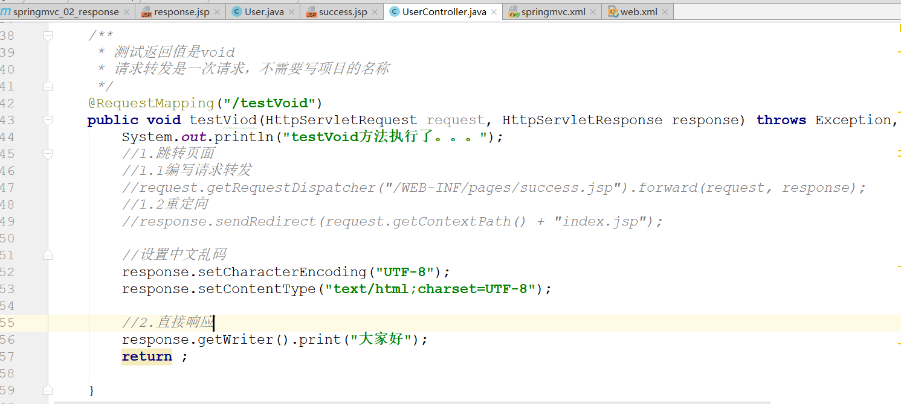

        <3> 返回值为ModelAndView
            * 如下所示

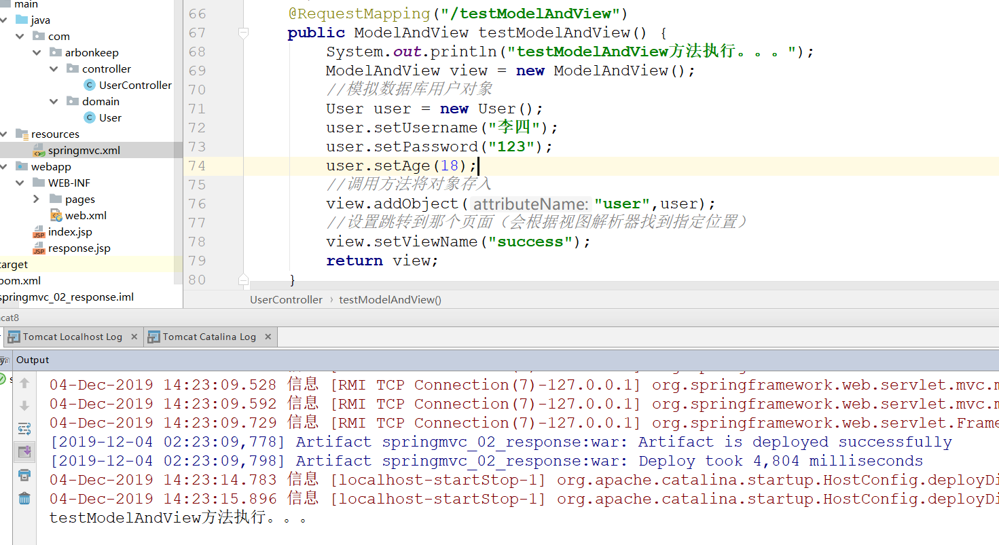

    2. 使用关键字的方式达到页面跳转和重定向

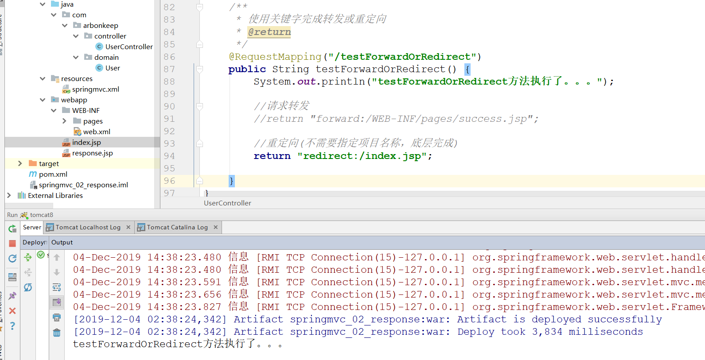

    3. ResponseBody响应json数据
        <1> 过滤静态资源的配置
            1) 由于之前配置了前端控制器，会拦截静态的资源文件。所以需要配置一个静态资源不被拦截的设置

            2) 在springmvc.xml<!--  -->中完成配置
                * 需要注意：配置的文件名需要一致

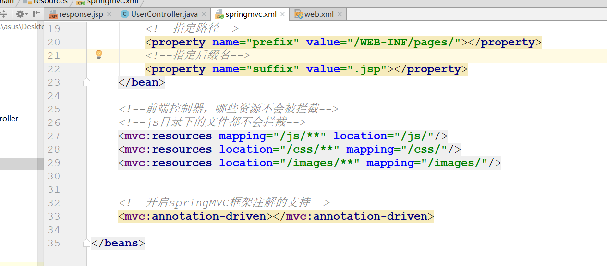

        <2> 发送ajax异步请求

        <3> 响应json格式数据
            1) json字符串和JavaBean对象互相转换的过程中，需要导入jackson的jar包

            2) 响应接收到的json数据(由于我们返回的是user对象需要使用注解ResponseBody转换成json数据返回)

## SpringMVC实现上传文件
    1. 传统方式上传文件(详细参考spring_03_fileupload)
        <1> 导入文件上传的jar包

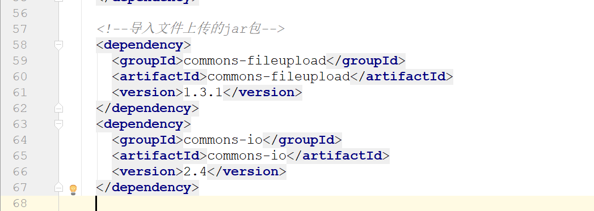

        <2> 编写文件上传的JSP页面

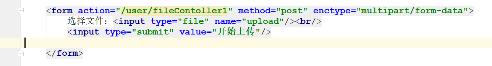

        <3> 编写文件上传的Controller控制器

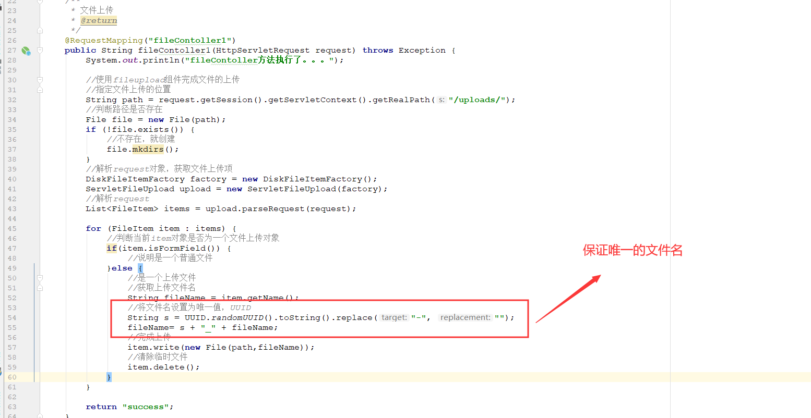

        <4> 保证上传文件的文件名为唯一值

    2. 使用springmvc的方式完成文件上传的实现原理

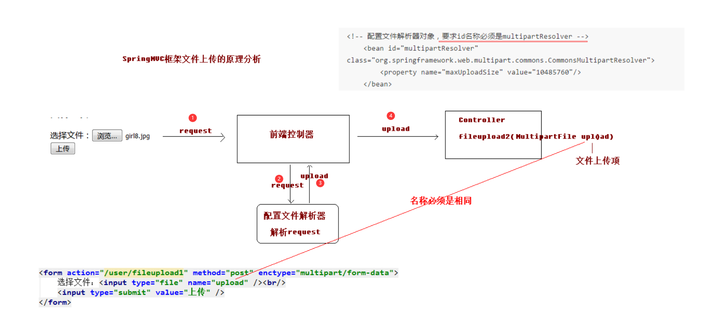

    3. 使用springmvc的方式完成文件上传
        <1> 配置文件解析器

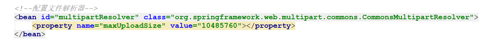

        <2> 编写文件上传的Controller控制器

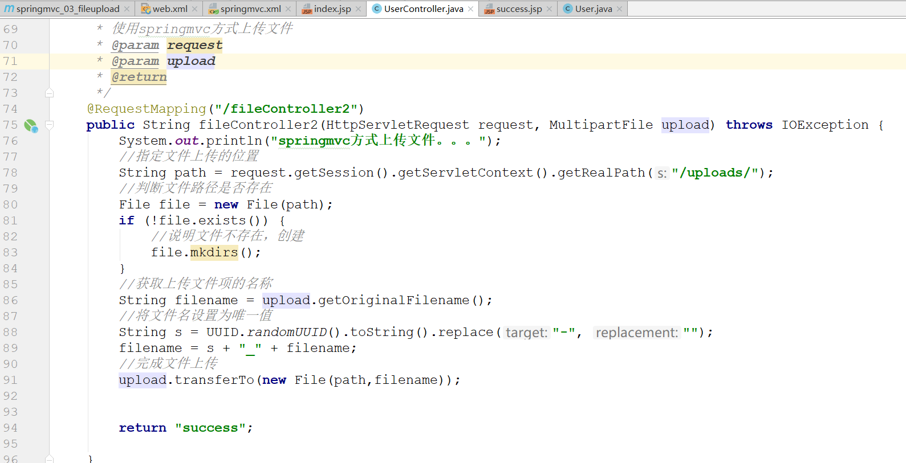

    4. springmvc跨服务器方式的文件上传
        <1> 跨服务器上传文件的原理

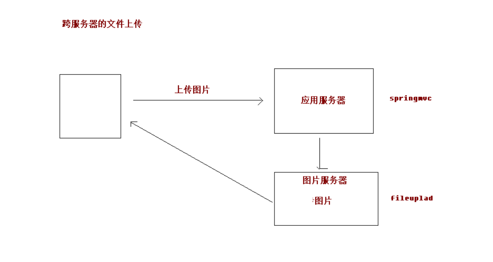

        <2> 跨服务器上传文件的步骤（参考spring_03_fileupload）
            1) 导入开发需要的jar包

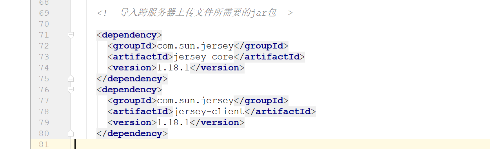

            2) 编写文件上传的JSP页面

            3) 编写控制器

## SpringMVC的异常处理
    1. 异常处理的原理解析
        * 为客户端提供给一个良好的提示

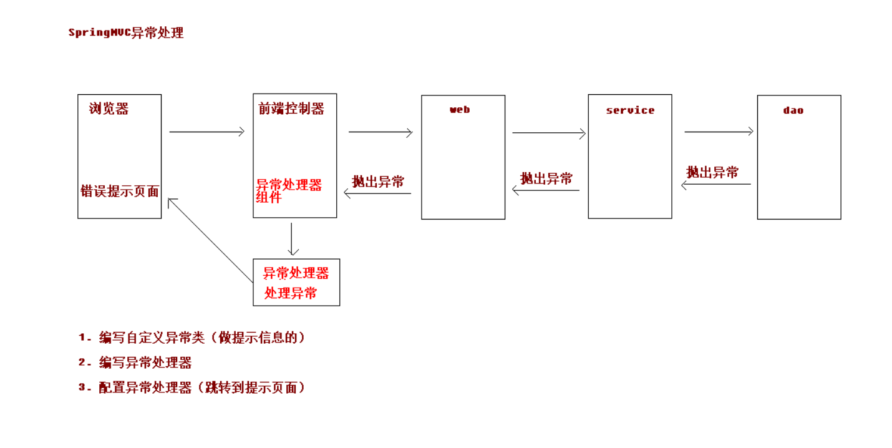

    2.  springmvc异常处理的流程
        <1> 编写一个异常类(用于提示信息)

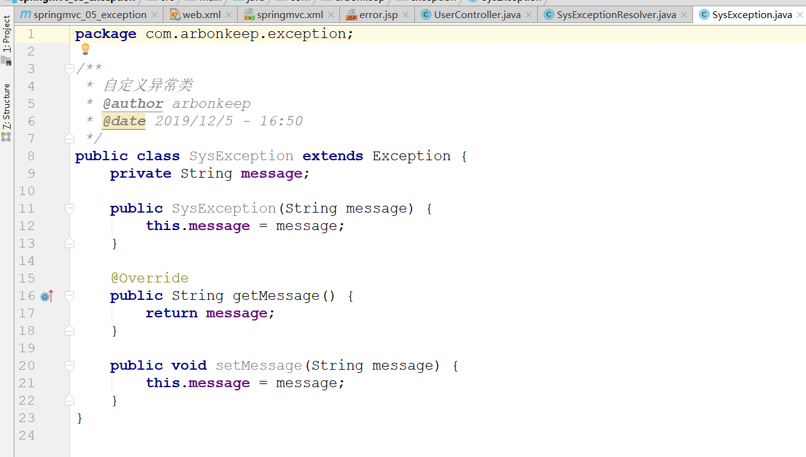

        <2> 编写异常处理器

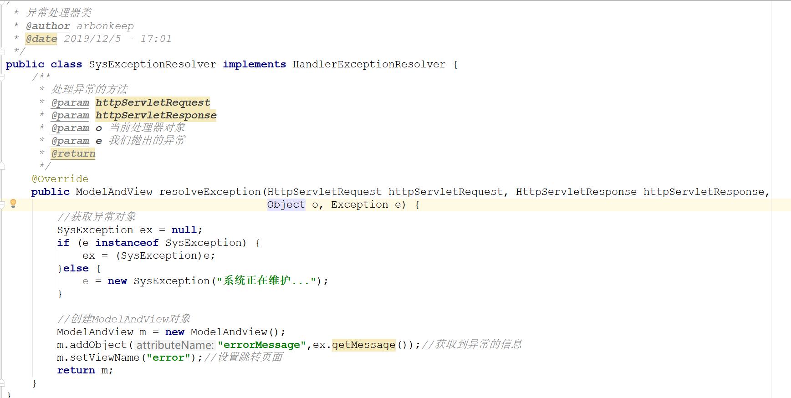

        <3> 配置异常处理器(跳转到提示页面)

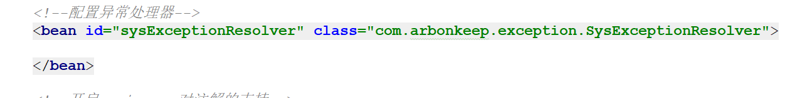

## SpringMVC中的拦截器
    1. 拦截器的相关概念
        <1> Spring MVC 的处理器拦截器类似于 Servlet 开发中的过滤器 Filter，用于对处理器进行预处理和后处理

        <2> 可以设置多个拦截器组成拦截器链。拦截器链（Interceptor Chain）将拦截器按一定的顺序联结成一条链。在访问被
            拦截的方法或字段时，拦截器链中的拦截器就会按其之前定义的顺序被调用。

        <3> SpringMVC中的拦截器与servlet中拦截器的区别
            1) 过滤器是Servlet规范的一部分，任何框架都可以使用过滤器技术。

            2) 拦截器是SpringMVC框架独有的。

            3) 过滤器配置了/*，可以拦截任何资源。

            4) 拦截器只会对控制器中的方法进行拦截。不会拦截静态资源
        
        <4> 拦截器实现原理

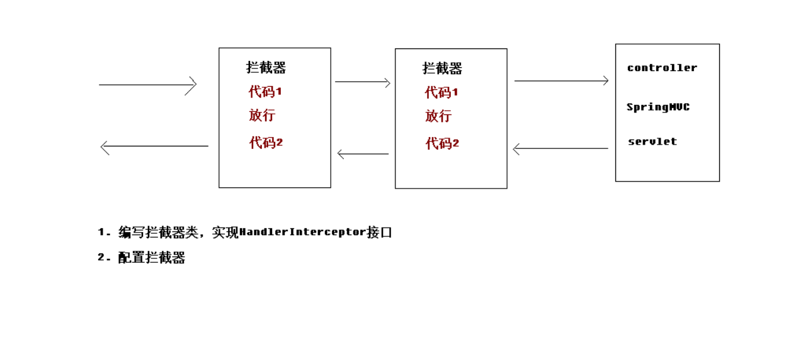

    2. 自定义拦截器实现步骤
        <1> 编写拦截器类，需要实现HandlerInterceptor接口，有三个实现方法
            1) preHandle:预处理方法，在controller方法之前执行

            2) postHandle:后处理方法，在controller方法之前执行,success.jsp之前执行

            3) afterCompletion:在success.jsp之后执行，最后执行的方法

        <2> 配置拦截器
            1) 需要注意的是：配置多个拦截器，陪在前面的先执行，配在后面的后执行

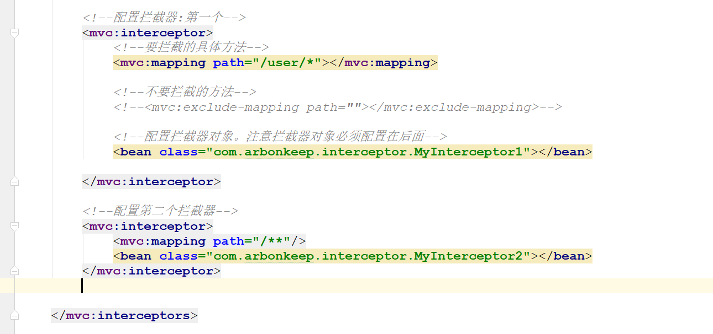    

            2) 拦截器代码执行顺序如下所示。与过滤器类似

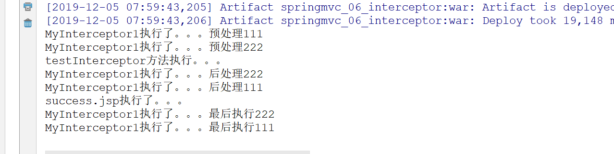 

        